Homework \#6
================

Question 1: Lab 3.6.2, p. 110-113
=================================

``` r
library(ISLR)
library(MASS)
```

**Goal:** predict `medv` using 13 predictors such as: \* `rm` (avg. \# rooms per house) \* `age` (avg. age house) \* `lstat` (% households w/ low socioeconomic status)

``` r
# fix(Boston) <- commented out because every load triggers an imported data window
names(Boston)
```

    ##  [1] "crim"    "zn"      "indus"   "chas"    "nox"     "rm"      "age"    
    ##  [8] "dis"     "rad"     "tax"     "ptratio" "black"   "lstat"   "medv"

### <span style="color:blue">Building the Linear Model</span>

``` r
attach(Boston)

lm.fit = lm(medv~lstat)

#lm.fit
#summary(lm.fit)
```

*Note:* if we try to do the lm.fit() without attaching `Boston`, then we are referencing columns/variables that are NOT within the scope of R's object global environment

-   We can get around the above issue by adding the `Boston$` before the column names, but this is just cumbersome, and it's easier to just `attach` the dataset

### <span style="color:blue">Exploring the Linear Model</span>

``` r
names(lm.fit)
```

    ##  [1] "coefficients"  "residuals"     "effects"       "rank"         
    ##  [5] "fitted.values" "assign"        "qr"            "df.residual"  
    ##  [9] "xlevels"       "call"          "terms"         "model"

``` r
coef(lm.fit)
```

    ## (Intercept)       lstat 
    ##  34.5538409  -0.9500494

``` r
#lm.fit$coefficients would work just as well, but it is not "as safe" --> trying to figure out why

#Now, building confidence interval:

confint(lm.fit)
```

    ##                 2.5 %     97.5 %
    ## (Intercept) 33.448457 35.6592247
    ## lstat       -1.026148 -0.8739505

``` r
confint(lm.fit,level = 0.99)
```

    ##                 0.5 %     99.5 %
    ## (Intercept) 33.099101 36.0085810
    ## lstat       -1.050199 -0.8498995

### <span style="color:blue">Utilizing `predict`</span>

Using `predict` to construct confidence intervals:

``` r
predict(lm.fit, 
        data.frame(lstat = c(5, 10, 15)),
        interval ="confidence")
```

    ##        fit      lwr      upr
    ## 1 29.80359 29.00741 30.59978
    ## 2 25.05335 24.47413 25.63256
    ## 3 20.30310 19.73159 20.87461

**Interpretation:**

-   the 95% confidence interval associated with `10` is `(24.474, 25.633)`

Using `predict` to construct prediction

``` r
predict(lm.fit, 
        data.frame(lstat = c(5, 10, 15)),
        interval ="prediction")
```

    ##        fit       lwr      upr
    ## 1 29.80359 17.565675 42.04151
    ## 2 25.05335 12.827626 37.27907
    ## 3 20.30310  8.077742 32.52846

**Interpretation:**

-   the 95% prediction interval associated with `10` is `(12.828, 37.280)`

### <span style="color:blue">Plotting LSRL</span>

``` r
library(ggplot2)
plot(lstat, medv)
#abline() plots a line on the previous plot
abline(lm.fit)
```

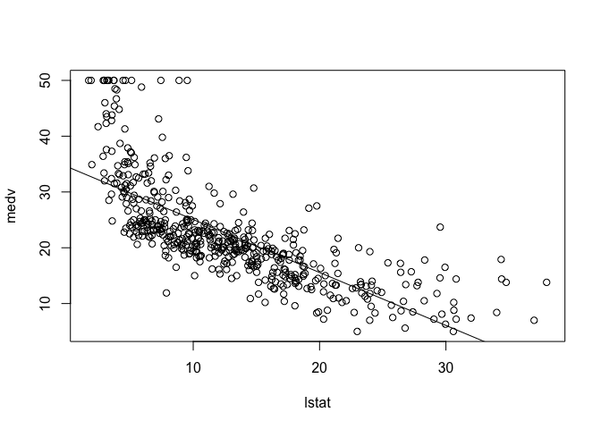

``` r
ggplot(Boston, aes(x = lstat, y = medv)) +
  geom_point() +
  geom_smooth(method = "lm", se = FALSE) 
```

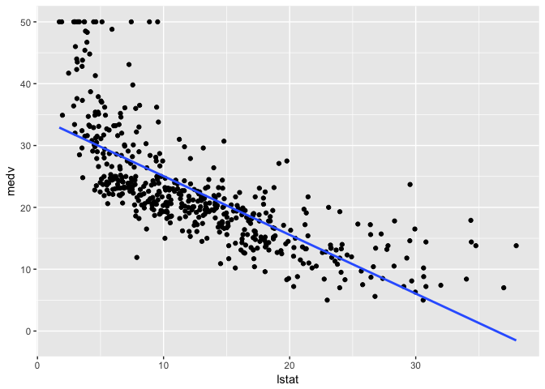

### <span style="color:blue">Playing around with the different abline and plot() variations </span>

``` r
plot(lstat,medv)
abline(lm.fit,lwd=3)
abline(lm.fit, lwd = 3, col = "red")
```

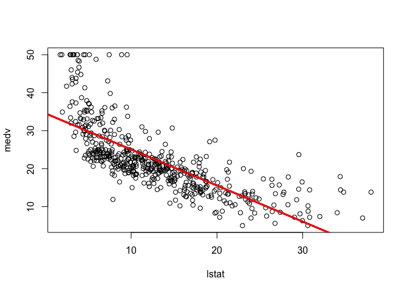

``` r
plot(lstat, medv, col = "red")
```

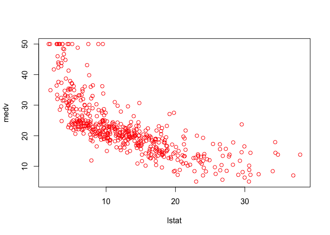

``` r
plot(lstat, medv, pch = 20)
```

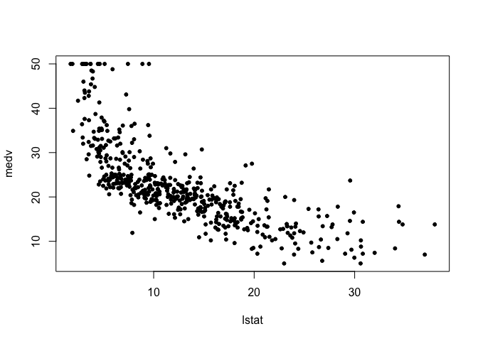

``` r
plot(lstat, medv, pch = "+")
```


``` r
plot(1:20, 1:20, pch = 1:20)
```

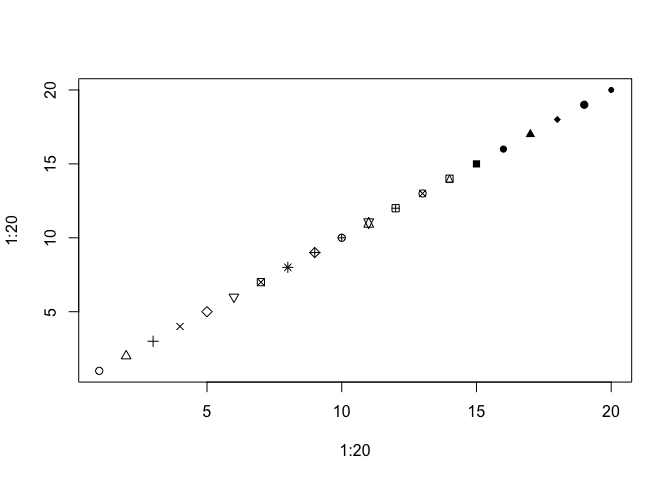

### <span style="color:blue">Viewing `lm()` results in one window </span>

``` r
par(mfrow = c(2,2))
plot(lm.fit)
```

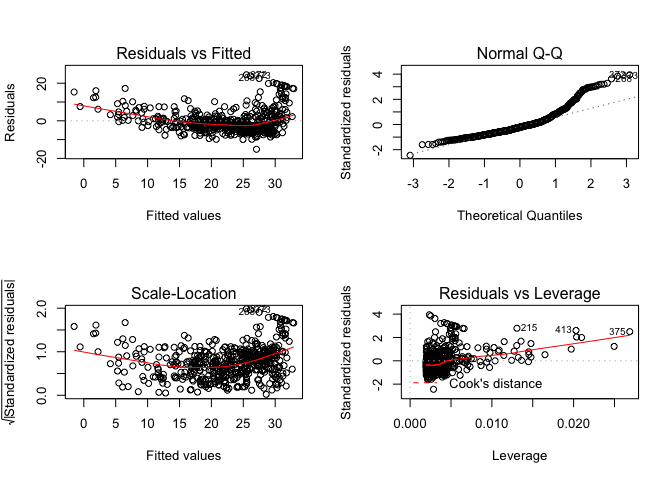

### <span style="color:blue">Plotting the Residuals</span>

``` r
plot(predict(lm.fit), residuals(lm.fit))
```

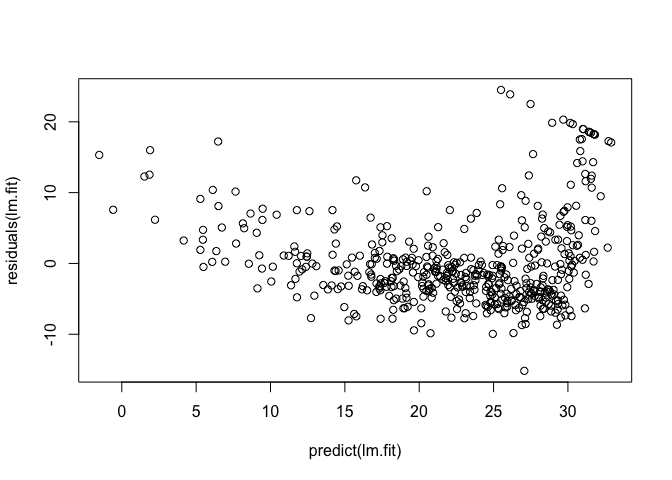

``` r
plot(predict(lm.fit), rstudent(lm.fit))
```

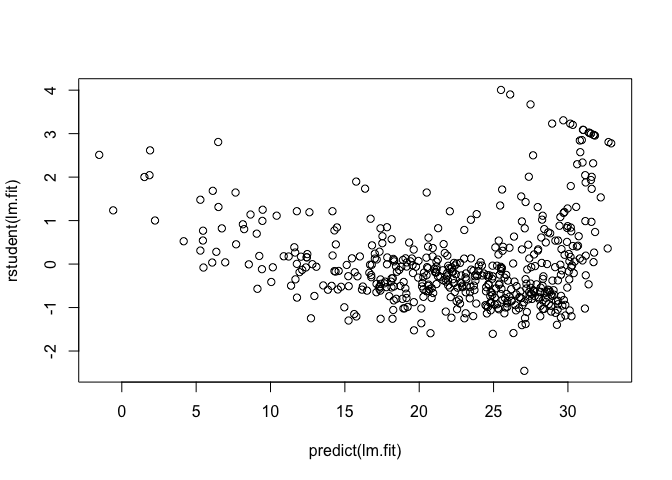

**rstudent:** calculates the *studentized* residuals which is: \* quotient resulting from `residual` / `estimate of sd`

``` r
plot(hatvalues(lm.fit))
```

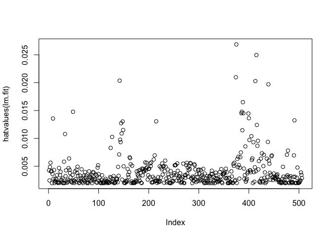

``` r
which.max(hatvalues(lm.fit))
```

    ## 375 
    ## 375

-   On basis of residual, evidence of non-linearity
-   **Leverage:** measure of how far away the independent variable values are from other observations

Question 2: Lab 3.6.3, p. 113 - 115
===================================

<span style="color:blue">Multiple Linear Regression</span>
----------------------------------------------------------

``` r
lm.mlrfit = lm(medv~lstat + age, data = Boston)
summary(lm.mlrfit)
```

    ## 
    ## Call:
    ## lm(formula = medv ~ lstat + age, data = Boston)
    ## 
    ## Residuals:
    ##     Min      1Q  Median      3Q     Max 
    ## -15.981  -3.978  -1.283   1.968  23.158 
    ## 
    ## Coefficients:
    ##             Estimate Std. Error t value Pr(>|t|)    
    ## (Intercept) 33.22276    0.73085  45.458  < 2e-16 ***
    ## lstat       -1.03207    0.04819 -21.416  < 2e-16 ***
    ## age          0.03454    0.01223   2.826  0.00491 ** 
    ## ---
    ## Signif. codes:  0 '***' 0.001 '**' 0.01 '*' 0.05 '.' 0.1 ' ' 1
    ## 
    ## Residual standard error: 6.173 on 503 degrees of freedom
    ## Multiple R-squared:  0.5513, Adjusted R-squared:  0.5495 
    ## F-statistic:   309 on 2 and 503 DF,  p-value: < 2.2e-16

To avoid applying MLR to all 13 variables, we do the following: `~.`

``` r
lm.mlrfit = lm(medv~., data=Boston)
summary(lm.mlrfit)
```

    ## 
    ## Call:
    ## lm(formula = medv ~ ., data = Boston)
    ## 
    ## Residuals:
    ##     Min      1Q  Median      3Q     Max 
    ## -15.595  -2.730  -0.518   1.777  26.199 
    ## 
    ## Coefficients:
    ##               Estimate Std. Error t value Pr(>|t|)    
    ## (Intercept)  3.646e+01  5.103e+00   7.144 3.28e-12 ***
    ## crim        -1.080e-01  3.286e-02  -3.287 0.001087 ** 
    ## zn           4.642e-02  1.373e-02   3.382 0.000778 ***
    ## indus        2.056e-02  6.150e-02   0.334 0.738288    
    ## chas         2.687e+00  8.616e-01   3.118 0.001925 ** 
    ## nox         -1.777e+01  3.820e+00  -4.651 4.25e-06 ***
    ## rm           3.810e+00  4.179e-01   9.116  < 2e-16 ***
    ## age          6.922e-04  1.321e-02   0.052 0.958229    
    ## dis         -1.476e+00  1.995e-01  -7.398 6.01e-13 ***
    ## rad          3.060e-01  6.635e-02   4.613 5.07e-06 ***
    ## tax         -1.233e-02  3.760e-03  -3.280 0.001112 ** 
    ## ptratio     -9.527e-01  1.308e-01  -7.283 1.31e-12 ***
    ## black        9.312e-03  2.686e-03   3.467 0.000573 ***
    ## lstat       -5.248e-01  5.072e-02 -10.347  < 2e-16 ***
    ## ---
    ## Signif. codes:  0 '***' 0.001 '**' 0.01 '*' 0.05 '.' 0.1 ' ' 1
    ## 
    ## Residual standard error: 4.745 on 492 degrees of freedom
    ## Multiple R-squared:  0.7406, Adjusted R-squared:  0.7338 
    ## F-statistic: 108.1 on 13 and 492 DF,  p-value: < 2.2e-16

In order to access different parts of the summary, we can do:

``` r
#returns the R^2
summary(lm.mlrfit)$r.sq
```

    ## [1] 0.7406427

``` r
# returns the RSE
summary(lm.mlrfit)$sigma
```

    ## [1] 4.745298

### <span style="color:blue">Using the `vif` function: Variance Inflation Factors</span>

``` r
library(car)
vif(lm.mlrfit)
```

    ##     crim       zn    indus     chas      nox       rm      age      dis 
    ## 1.792192 2.298758 3.991596 1.073995 4.393720 1.933744 3.100826 3.955945 
    ##      rad      tax  ptratio    black    lstat 
    ## 7.484496 9.008554 1.799084 1.348521 2.941491

\*\* Note: \*\* VIF helps to determine multicollinearity

### <span style="color:blue"> Accessing all but one variable </span>

``` r
lm.mlrfit.noage = lm(medv~.-age, data = Boston)
summary(lm.mlrfit.noage)
```

    ## 
    ## Call:
    ## lm(formula = medv ~ . - age, data = Boston)
    ## 
    ## Residuals:
    ##      Min       1Q   Median       3Q      Max 
    ## -15.6054  -2.7313  -0.5188   1.7601  26.2243 
    ## 
    ## Coefficients:
    ##               Estimate Std. Error t value Pr(>|t|)    
    ## (Intercept)  36.436927   5.080119   7.172 2.72e-12 ***
    ## crim         -0.108006   0.032832  -3.290 0.001075 ** 
    ## zn            0.046334   0.013613   3.404 0.000719 ***
    ## indus         0.020562   0.061433   0.335 0.737989    
    ## chas          2.689026   0.859598   3.128 0.001863 ** 
    ## nox         -17.713540   3.679308  -4.814 1.97e-06 ***
    ## rm            3.814394   0.408480   9.338  < 2e-16 ***
    ## dis          -1.478612   0.190611  -7.757 5.03e-14 ***
    ## rad           0.305786   0.066089   4.627 4.75e-06 ***
    ## tax          -0.012329   0.003755  -3.283 0.001099 ** 
    ## ptratio      -0.952211   0.130294  -7.308 1.10e-12 ***
    ## black         0.009321   0.002678   3.481 0.000544 ***
    ## lstat        -0.523852   0.047625 -10.999  < 2e-16 ***
    ## ---
    ## Signif. codes:  0 '***' 0.001 '**' 0.01 '*' 0.05 '.' 0.1 ' ' 1
    ## 
    ## Residual standard error: 4.74 on 493 degrees of freedom
    ## Multiple R-squared:  0.7406, Adjusted R-squared:  0.7343 
    ## F-statistic: 117.3 on 12 and 493 DF,  p-value: < 2.2e-16

### <span style="color:blue">Updating the linear models with variables</span>

``` r
lm.mlrfit.withage = update(lm.mlrfit, ~.-age)
```

Question 3: Lab 3.6.4, p. 115
=============================

<span style="color:blue"> Interaction Terms </span>
---------------------------------------------------

``` r
summary(lm(medv~lstat*age, data = Boston))
```

    ## 
    ## Call:
    ## lm(formula = medv ~ lstat * age, data = Boston)
    ## 
    ## Residuals:
    ##     Min      1Q  Median      3Q     Max 
    ## -15.806  -4.045  -1.333   2.085  27.552 
    ## 
    ## Coefficients:
    ##               Estimate Std. Error t value Pr(>|t|)    
    ## (Intercept) 36.0885359  1.4698355  24.553  < 2e-16 ***
    ## lstat       -1.3921168  0.1674555  -8.313 8.78e-16 ***
    ## age         -0.0007209  0.0198792  -0.036   0.9711    
    ## lstat:age    0.0041560  0.0018518   2.244   0.0252 *  
    ## ---
    ## Signif. codes:  0 '***' 0.001 '**' 0.01 '*' 0.05 '.' 0.1 ' ' 1
    ## 
    ## Residual standard error: 6.149 on 502 degrees of freedom
    ## Multiple R-squared:  0.5557, Adjusted R-squared:  0.5531 
    ## F-statistic: 209.3 on 3 and 502 DF,  p-value: < 2.2e-16

**Note:** The above is shorthand for `lstat + age + lstat:age`

Question 4: Lab 3.6.5, p. 115 - 117
===================================

<span style="color:blue"> Non-linear Transformations of Predictors </span>
--------------------------------------------------------------------------

``` r
lm.fit.square = lm(medv~lstat + I(lstat^2))
summary(lm.fit.square)
```

    ## 
    ## Call:
    ## lm(formula = medv ~ lstat + I(lstat^2))
    ## 
    ## Residuals:
    ##      Min       1Q   Median       3Q      Max 
    ## -15.2834  -3.8313  -0.5295   2.3095  25.4148 
    ## 
    ## Coefficients:
    ##              Estimate Std. Error t value Pr(>|t|)    
    ## (Intercept) 42.862007   0.872084   49.15   <2e-16 ***
    ## lstat       -2.332821   0.123803  -18.84   <2e-16 ***
    ## I(lstat^2)   0.043547   0.003745   11.63   <2e-16 ***
    ## ---
    ## Signif. codes:  0 '***' 0.001 '**' 0.01 '*' 0.05 '.' 0.1 ' ' 1
    ## 
    ## Residual standard error: 5.524 on 503 degrees of freedom
    ## Multiple R-squared:  0.6407, Adjusted R-squared:  0.6393 
    ## F-statistic: 448.5 on 2 and 503 DF,  p-value: < 2.2e-16

**Note:** With a near-zero p-value, this square model seems to be a better fit for the data

### <span style="color:blue"> Comparing the models with `anova()` </span>

``` r
anova(lm.fit, lm.fit.square)
```

    ## Analysis of Variance Table
    ## 
    ## Model 1: medv ~ lstat
    ## Model 2: medv ~ lstat + I(lstat^2)
    ##   Res.Df   RSS Df Sum of Sq     F    Pr(>F)    
    ## 1    504 19472                                 
    ## 2    503 15347  1    4125.1 135.2 < 2.2e-16 ***
    ## ---
    ## Signif. codes:  0 '***' 0.001 '**' 0.01 '*' 0.05 '.' 0.1 ' ' 1

*H*<sub>0</sub> : Two models fit the data equally well

*H*<sub>*a*</sub> : Full model is superior (squared model)

**Analysis**:

-   With F-stat of 135 and associated p-value of nearly 0, then it shows that the model with the linear and squared predictors is superior to the model with just the linear predictor

``` r
par(mfrow=c(2,2))
plot(lm.fit.square)
```

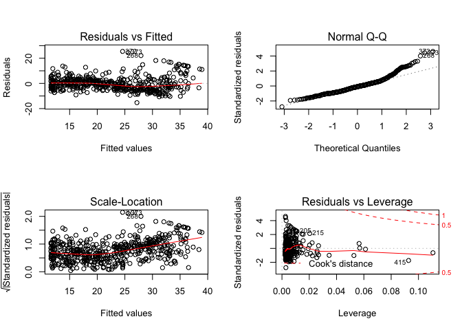

**FOR NTH-TERM POLYNOMIALS, USE `poly`**

``` r
lm.fit.fifth = lm(medv~poly(lstat, 5))
summary(lm.fit.fifth)
```

    ## 
    ## Call:
    ## lm(formula = medv ~ poly(lstat, 5))
    ## 
    ## Residuals:
    ##      Min       1Q   Median       3Q      Max 
    ## -13.5433  -3.1039  -0.7052   2.0844  27.1153 
    ## 
    ## Coefficients:
    ##                  Estimate Std. Error t value Pr(>|t|)    
    ## (Intercept)       22.5328     0.2318  97.197  < 2e-16 ***
    ## poly(lstat, 5)1 -152.4595     5.2148 -29.236  < 2e-16 ***
    ## poly(lstat, 5)2   64.2272     5.2148  12.316  < 2e-16 ***
    ## poly(lstat, 5)3  -27.0511     5.2148  -5.187 3.10e-07 ***
    ## poly(lstat, 5)4   25.4517     5.2148   4.881 1.42e-06 ***
    ## poly(lstat, 5)5  -19.2524     5.2148  -3.692 0.000247 ***
    ## ---
    ## Signif. codes:  0 '***' 0.001 '**' 0.01 '*' 0.05 '.' 0.1 ' ' 1
    ## 
    ## Residual standard error: 5.215 on 500 degrees of freedom
    ## Multiple R-squared:  0.6817, Adjusted R-squared:  0.6785 
    ## F-statistic: 214.2 on 5 and 500 DF,  p-value: < 2.2e-16

-   This shows that polynomials up to the 5th power are significant in the regression fit

``` r
lm.fit.sixth = lm(medv~poly(lstat, 6))
summary(lm.fit.sixth)
```

    ## 
    ## Call:
    ## lm(formula = medv ~ poly(lstat, 6))
    ## 
    ## Residuals:
    ##      Min       1Q   Median       3Q      Max 
    ## -14.7317  -3.1571  -0.6941   2.0756  26.8994 
    ## 
    ## Coefficients:
    ##                  Estimate Std. Error t value Pr(>|t|)    
    ## (Intercept)       22.5328     0.2317  97.252  < 2e-16 ***
    ## poly(lstat, 6)1 -152.4595     5.2119 -29.252  < 2e-16 ***
    ## poly(lstat, 6)2   64.2272     5.2119  12.323  < 2e-16 ***
    ## poly(lstat, 6)3  -27.0511     5.2119  -5.190 3.06e-07 ***
    ## poly(lstat, 6)4   25.4517     5.2119   4.883 1.41e-06 ***
    ## poly(lstat, 6)5  -19.2524     5.2119  -3.694 0.000245 ***
    ## poly(lstat, 6)6    6.5088     5.2119   1.249 0.212313    
    ## ---
    ## Signif. codes:  0 '***' 0.001 '**' 0.01 '*' 0.05 '.' 0.1 ' ' 1
    ## 
    ## Residual standard error: 5.212 on 499 degrees of freedom
    ## Multiple R-squared:  0.6827, Adjusted R-squared:  0.6789 
    ## F-statistic: 178.9 on 6 and 499 DF,  p-value: < 2.2e-16

-   But this analysis shows that any terms beyond the fifth power are NOT signficant predictors

**USING LOG PREDICTORS**

``` r
 summary(lm(medv~log(rm), data = Boston))
```

    ## 
    ## Call:
    ## lm(formula = medv ~ log(rm), data = Boston)
    ## 
    ## Residuals:
    ##     Min      1Q  Median      3Q     Max 
    ## -19.487  -2.875  -0.104   2.837  39.816 
    ## 
    ## Coefficients:
    ##             Estimate Std. Error t value Pr(>|t|)    
    ## (Intercept)  -76.488      5.028  -15.21   <2e-16 ***
    ## log(rm)       54.055      2.739   19.73   <2e-16 ***
    ## ---
    ## Signif. codes:  0 '***' 0.001 '**' 0.01 '*' 0.05 '.' 0.1 ' ' 1
    ## 
    ## Residual standard error: 6.915 on 504 degrees of freedom
    ## Multiple R-squared:  0.4358, Adjusted R-squared:  0.4347 
    ## F-statistic: 389.3 on 1 and 504 DF,  p-value: < 2.2e-16

Question 5: Lab 3.6.6, p. 117 - 119
===================================

### <span style="color:blue"> Qualitative Predictors </span>

``` r
#fix(Carseats) <- commented out because every load triggers an imported data window
names(Carseats)
```

    ##  [1] "Sales"       "CompPrice"   "Income"      "Advertising" "Population" 
    ##  [6] "Price"       "ShelveLoc"   "Age"         "Education"   "Urban"      
    ## [11] "US"

``` r
lm.car.fit = lm(Sales ~. + Income:Advertising + Price:Age, data = Carseats)
summary(lm.car.fit)
```

    ## 
    ## Call:
    ## lm(formula = Sales ~ . + Income:Advertising + Price:Age, data = Carseats)
    ## 
    ## Residuals:
    ##     Min      1Q  Median      3Q     Max 
    ## -2.9208 -0.7503  0.0177  0.6754  3.3413 
    ## 
    ## Coefficients:
    ##                      Estimate Std. Error t value Pr(>|t|)    
    ## (Intercept)         6.5755654  1.0087470   6.519 2.22e-10 ***
    ## CompPrice           0.0929371  0.0041183  22.567  < 2e-16 ***
    ## Income              0.0108940  0.0026044   4.183 3.57e-05 ***
    ## Advertising         0.0702462  0.0226091   3.107 0.002030 ** 
    ## Population          0.0001592  0.0003679   0.433 0.665330    
    ## Price              -0.1008064  0.0074399 -13.549  < 2e-16 ***
    ## ShelveLocGood       4.8486762  0.1528378  31.724  < 2e-16 ***
    ## ShelveLocMedium     1.9532620  0.1257682  15.531  < 2e-16 ***
    ## Age                -0.0579466  0.0159506  -3.633 0.000318 ***
    ## Education          -0.0208525  0.0196131  -1.063 0.288361    
    ## UrbanYes            0.1401597  0.1124019   1.247 0.213171    
    ## USYes              -0.1575571  0.1489234  -1.058 0.290729    
    ## Income:Advertising  0.0007510  0.0002784   2.698 0.007290 ** 
    ## Price:Age           0.0001068  0.0001333   0.801 0.423812    
    ## ---
    ## Signif. codes:  0 '***' 0.001 '**' 0.01 '*' 0.05 '.' 0.1 ' ' 1
    ## 
    ## Residual standard error: 1.011 on 386 degrees of freedom
    ## Multiple R-squared:  0.8761, Adjusted R-squared:  0.8719 
    ## F-statistic:   210 on 13 and 386 DF,  p-value: < 2.2e-16

### <span style="color:blue"> Viewing dummy variables generated by R </span>

``` r
attach(Carseats)
contrasts(ShelveLoc)
```

    ##        Good Medium
    ## Bad       0      0
    ## Good      1      0
    ## Medium    0      1

**Interpretation:**

-   `ShelveLocGood`: indicates positive output in good shelving location associated with high sales

-   `ShelveLocMedium`: indicates positive output in medium shelving location associated with higher sales than bad shelving location but lower sales than good shelving location

Question 6: Exercise 8, p. 121 - 122
====================================

### <span style="color:blue"> Exercise 8 </span>

importing the dataset:

``` r
#fix(Auto)<-commented out because every load triggers an imported data window
names(Auto)
```

    ## [1] "mpg"          "cylinders"    "displacement" "horsepower"  
    ## [5] "weight"       "acceleration" "year"         "origin"      
    ## [9] "name"

1.  <span style="color:blue">Using `lm()` to perform simple linear regression with `mpg` as response and `horsepower` as predictor</span>

``` r
lm.auto.fit = lm(mpg~horsepower, data = Auto)
summary(lm.auto.fit)
```

    ## 
    ## Call:
    ## lm(formula = mpg ~ horsepower, data = Auto)
    ## 
    ## Residuals:
    ##      Min       1Q   Median       3Q      Max 
    ## -13.5710  -3.2592  -0.3435   2.7630  16.9240 
    ## 
    ## Coefficients:
    ##              Estimate Std. Error t value Pr(>|t|)    
    ## (Intercept) 39.935861   0.717499   55.66   <2e-16 ***
    ## horsepower  -0.157845   0.006446  -24.49   <2e-16 ***
    ## ---
    ## Signif. codes:  0 '***' 0.001 '**' 0.01 '*' 0.05 '.' 0.1 ' ' 1
    ## 
    ## Residual standard error: 4.906 on 390 degrees of freedom
    ## Multiple R-squared:  0.6059, Adjusted R-squared:  0.6049 
    ## F-statistic: 599.7 on 1 and 390 DF,  p-value: < 2.2e-16

``` r
plot(mpg~horsepower, data = Auto)
```


``` r
print("Predicted Value @ horsepower = 98")
```

    ## [1] "Predicted Value @ horsepower = 98"

``` r
predict(lm.auto.fit, 
        data.frame(horsepower =98))
```

    ##        1 
    ## 24.46708

``` r
print("Confidence Interval:")
```

    ## [1] "Confidence Interval:"

``` r
predict(lm.auto.fit, 
        data.frame(horsepower = 98),
        interval ="confidence",
        level =0.95)
```

    ##        fit      lwr      upr
    ## 1 24.46708 23.97308 24.96108

``` r
print("Prediction Interval: ")
```

    ## [1] "Prediction Interval: "

``` r
predict(lm.auto.fit, 
        data.frame(horsepower = 98),
        interval ="prediction", 
        level =0.95)
```

    ##        fit     lwr      upr
    ## 1 24.46708 14.8094 34.12476

-   **i, ii, & iii**: There exists a strong, negative relationship between the predictor and the response

-   **iv**:

        * At a `horsepower` of 98, the predicted `mpg` is 24.67 

        * The associated 95% **confidence interval** is (23.973, 24.961)

        * The associated 95% **prediction interval** is (14.809, 34.125)

1.  <span style="color:blue">Plotting</span>

``` r
attach(Auto)
```

    ## The following object is masked from package:ggplot2:
    ## 
    ##     mpg

``` r
plot(horsepower, mpg) + 
  title("Plot of Horsepower vs. mpg")
```

    ## numeric(0)

``` r
abline(lm.auto.fit)
```

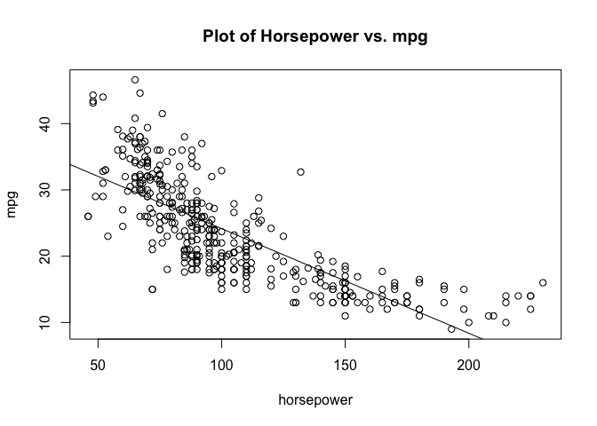

``` r
##ggplot 
ggplot(Auto, aes(x=horsepower, y = mpg)) +
  geom_point() +
  geom_smooth(method = "lm", se = FALSE) +
  ggtitle("Plot of Horsepower vs. mpg")
```

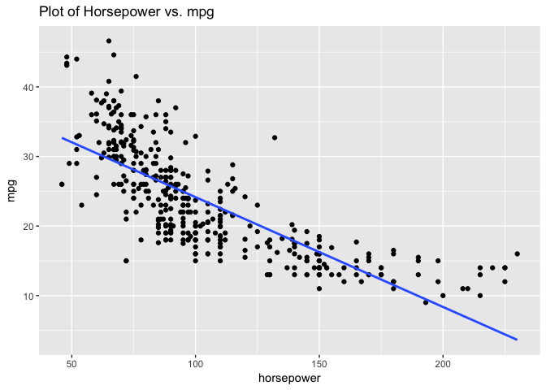

1.  <span style="color:blue">Plotting diagnostic plots of LSR</span>

``` r
par(mfrow=c(2,2))
plot(lm.auto.fit)
```

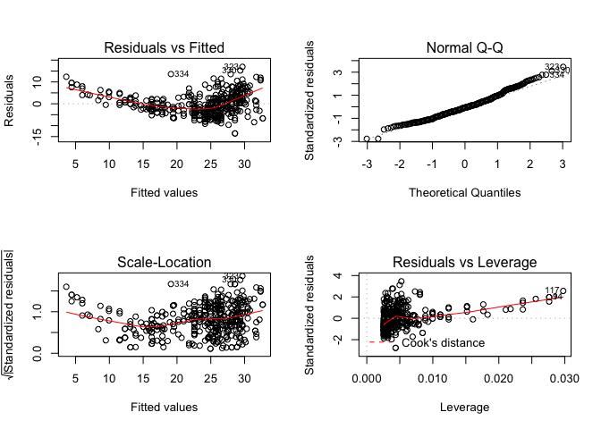

**Comments:**

-   There exists normality

-   There exists Heteroscedasticity

-   Not too much leverage

-   Approximately parametric (definitively not absolutely linear)

Question 7: Exercise 9, p. 121
==============================

1.  <span style="color:blue">Scatterplot matrix with all of the variables</span>

``` r
attach(Auto)
```

    ## The following objects are masked from Auto (pos = 3):
    ## 
    ##     acceleration, cylinders, displacement, horsepower, mpg, name,
    ##     origin, weight, year

    ## The following object is masked from package:ggplot2:
    ## 
    ##     mpg

``` r
pairs(mpg~.,
      data=Auto, 
      main="Simple Scatterplot Matrix")
```

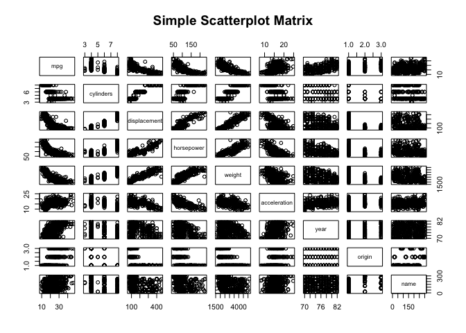

``` r
#corplot
```

1.  <span style="color:blue">Matrix of Correlations b/w variables using cor(). Exclude `name`</span>

``` r
cor(y= Auto$mpg, x = Auto[,2:8])
```

    ##                    [,1]
    ## cylinders    -0.7776175
    ## displacement -0.8051269
    ## horsepower   -0.7784268
    ## weight       -0.8322442
    ## acceleration  0.4233285
    ## year          0.5805410
    ## origin        0.5652088

1.  <span style="color:blue">Multiple Linear Regression</span>

``` r
lm.auto.mlr = lm(mpg~.-name, data = Auto)
summary(lm.auto.mlr)
```

    ## 
    ## Call:
    ## lm(formula = mpg ~ . - name, data = Auto)
    ## 
    ## Residuals:
    ##     Min      1Q  Median      3Q     Max 
    ## -9.5903 -2.1565 -0.1169  1.8690 13.0604 
    ## 
    ## Coefficients:
    ##                Estimate Std. Error t value Pr(>|t|)    
    ## (Intercept)  -17.218435   4.644294  -3.707  0.00024 ***
    ## cylinders     -0.493376   0.323282  -1.526  0.12780    
    ## displacement   0.019896   0.007515   2.647  0.00844 ** 
    ## horsepower    -0.016951   0.013787  -1.230  0.21963    
    ## weight        -0.006474   0.000652  -9.929  < 2e-16 ***
    ## acceleration   0.080576   0.098845   0.815  0.41548    
    ## year           0.750773   0.050973  14.729  < 2e-16 ***
    ## origin         1.426141   0.278136   5.127 4.67e-07 ***
    ## ---
    ## Signif. codes:  0 '***' 0.001 '**' 0.01 '*' 0.05 '.' 0.1 ' ' 1
    ## 
    ## Residual standard error: 3.328 on 384 degrees of freedom
    ## Multiple R-squared:  0.8215, Adjusted R-squared:  0.8182 
    ## F-statistic: 252.4 on 7 and 384 DF,  p-value: < 2.2e-16

``` r
coef(lm.auto.mlr)
```

    ##   (Intercept)     cylinders  displacement    horsepower        weight 
    ## -17.218434622  -0.493376319   0.019895644  -0.016951144  -0.006474043 
    ##  acceleration          year        origin 
    ##   0.080575838   0.750772678   1.426140495

-   **i, ii:** There exists a relationship between some of the predictors and the response. The following predictors have a statistically significant relationship to the response:
    -   `displacement`
    -   `weight`
    -   `year`
    -   `origin`
-   **iii:** The coefficient of `year` (0.751) suggests that there exists a strong positive relationship between `year` and `mpg`. Furthermore, this also suggests that for every additional year, `mpg` on a car increases by 0.751

1.  <span style="color:blue">Plotting the Linear Regression Fit</span>

``` r
par(mfrow=c(2,2))
plot(lm.auto.mlr)
```

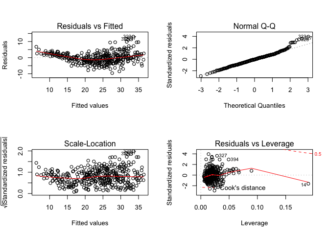

-   Only one "Large" outlier --&gt; the data point marked "14" indicates incredibly high leverage

\*Approximately homoscedatic

-   Approximately linear

-   Definitely linear

e)<span style="color:blue">Checking Interactions</span>

``` r
attach(Auto)
```

    ## The following objects are masked from Auto (pos = 3):
    ## 
    ##     acceleration, cylinders, displacement, horsepower, mpg, name,
    ##     origin, weight, year

    ## The following objects are masked from Auto (pos = 4):
    ## 
    ##     acceleration, cylinders, displacement, horsepower, mpg, name,
    ##     origin, weight, year

    ## The following object is masked from package:ggplot2:
    ## 
    ##     mpg

``` r
lm(mpg~cylinders:displacement)
```

    ## 
    ## Call:
    ## lm(formula = mpg ~ cylinders:displacement)
    ## 
    ## Coefficients:
    ##            (Intercept)  cylinders:displacement  
    ##              30.989620               -0.006118

``` r
lm(mpg~cylinders:horsepower)
```

    ## 
    ## Call:
    ## lm(formula = mpg ~ cylinders:horsepower)
    ## 
    ## Coefficients:
    ##          (Intercept)  cylinders:horsepower  
    ##             32.49813              -0.01444

``` r
lm(mpg~cylinders:weight)
```

    ## 
    ## Call:
    ## lm(formula = mpg ~ cylinders:weight)
    ## 
    ## Coefficients:
    ##      (Intercept)  cylinders:weight  
    ##       34.2947992        -0.0006168

``` r
lm(mpg~cylinders:acceleration)
```

    ## 
    ## Call:
    ## lm(formula = mpg ~ cylinders:acceleration)
    ## 
    ## Coefficients:
    ##            (Intercept)  cylinders:acceleration  
    ##                40.9279                 -0.2115

``` r
lm(mpg~cylinders:year)
```

    ## 
    ## Call:
    ## lm(formula = mpg ~ cylinders:year)
    ## 
    ## Coefficients:
    ##    (Intercept)  cylinders:year  
    ##       42.48053        -0.04602

``` r
lm(mpg~cylinders:origin)
```

    ## 
    ## Call:
    ## lm(formula = mpg ~ cylinders:origin)
    ## 
    ## Coefficients:
    ##      (Intercept)  cylinders:origin  
    ##           19.664             0.482

``` r
lm(mpg~displacement:horsepower)
```

    ## 
    ## Call:
    ## lm(formula = mpg ~ displacement:horsepower)
    ## 
    ## Coefficients:
    ##             (Intercept)  displacement:horsepower  
    ##              29.8890103               -0.0002694

``` r
lm(mpg~displacement:weight)
```

    ## 
    ## Call:
    ## lm(formula = mpg ~ displacement:weight)
    ## 
    ## Coefficients:
    ##         (Intercept)  displacement:weight  
    ##           3.126e+01           -1.182e-05

``` r
lm(mpg~displacement:acceleration)
```

    ## 
    ## Call:
    ## lm(formula = mpg ~ displacement:acceleration)
    ## 
    ## Coefficients:
    ##               (Intercept)  displacement:acceleration  
    ##                 36.933531                  -0.004708

``` r
lm(mpg~displacement:year)
```

    ## 
    ## Call:
    ## lm(formula = mpg ~ displacement:year)
    ## 
    ## Coefficients:
    ##       (Intercept)  displacement:year  
    ##          35.29577           -0.00081

``` r
lm(mpg~displacement:origin)
```

    ## 
    ## Call:
    ## lm(formula = mpg ~ displacement:origin)
    ## 
    ## Coefficients:
    ##         (Intercept)  displacement:origin  
    ##            33.44016             -0.03922

``` r
lm(mpg~horsepower:weight)
```

    ## 
    ## Call:
    ## lm(formula = mpg ~ horsepower:weight)
    ## 
    ## Coefficients:
    ##       (Intercept)  horsepower:weight  
    ##         3.292e+01         -2.791e-05

``` r
lm(mpg~horsepower:acceleration)
```

    ## 
    ## Call:
    ## lm(formula = mpg ~ horsepower:acceleration)
    ## 
    ## Coefficients:
    ##             (Intercept)  horsepower:acceleration  
    ##                47.72990                 -0.01566

``` r
lm(mpg~horsepower:year)
```

    ## 
    ## Call:
    ## lm(formula = mpg ~ horsepower:year)
    ## 
    ## Coefficients:
    ##     (Intercept)  horsepower:year  
    ##       40.451416        -0.002158

``` r
lm(mpg~horsepower:origin)
```

    ## 
    ## Call:
    ## lm(formula = mpg ~ horsepower:origin)
    ## 
    ## Coefficients:
    ##       (Intercept)  horsepower:origin  
    ##         23.232932           0.001414

``` r
lm(mpg~weight:acceleration)
```

    ## 
    ## Call:
    ## lm(formula = mpg ~ weight:acceleration)
    ## 
    ## Coefficients:
    ##         (Intercept)  weight:acceleration  
    ##          40.5317687           -0.0003772

``` r
lm(mpg~weight:year)
```

    ## 
    ## Call:
    ## lm(formula = mpg ~ weight:year)
    ## 
    ## Coefficients:
    ## (Intercept)  weight:year  
    ##   4.571e+01   -9.882e-05

``` r
lm(mpg~weight:origin)
```

    ## 
    ## Call:
    ## lm(formula = mpg ~ weight:origin)
    ## 
    ## Coefficients:
    ##   (Intercept)  weight:origin  
    ##     2.030e+01      7.315e-04

``` r
lm(mpg~acceleration:year)
```

    ## 
    ## Call:
    ## lm(formula = mpg ~ acceleration:year)
    ## 
    ## Coefficients:
    ##       (Intercept)  acceleration:year  
    ##           2.56177            0.01764

``` r
lm(mpg~acceleration:origin)
```

    ## 
    ## Call:
    ## lm(formula = mpg ~ acceleration:origin)
    ## 
    ## Coefficients:
    ##         (Intercept)  acceleration:origin  
    ##             14.9387               0.3407

f)<span style="color:blue">Varying Transformations</span>

``` r
lm.auto.sq = lm(mpg+Auto[,2:8]+ I(Auto[,2:8])^2, data = Auto)
summary(lm.auto.sq)
```

    ## 
    ## Call:
    ## lm(formula = mpg + Auto[, 2:8] + I(Auto[, 2:8])^2, data = Auto)
    ## 
    ## Residuals:
    ##      Min       1Q   Median       3Q      Max 
    ## -1.39763 -0.37385  0.00738  0.21238  1.49877 
    ## 
    ## Coefficients:
    ##                Estimate Std. Error t value Pr(>|t|)    
    ## (Intercept)   2.5424031  0.7206057   3.528 0.000469 ***
    ## displacement  0.0154275  0.0008862  17.408  < 2e-16 ***
    ## horsepower   -0.0052229  0.0021571  -2.421 0.015929 *  
    ## weight        0.0002567  0.0001020   2.518 0.012208 *  
    ## acceleration -0.0154412  0.0155628  -0.992 0.321731    
    ## year         -0.0024005  0.0080349  -0.299 0.765289    
    ## origin        0.0848696  0.0436337   1.945 0.052497 .  
    ## ---
    ## Signif. codes:  0 '***' 0.001 '**' 0.01 '*' 0.05 '.' 0.1 ' ' 1
    ## 
    ## Residual standard error: 0.5246 on 385 degrees of freedom
    ## Multiple R-squared:  0.9069, Adjusted R-squared:  0.9054 
    ## F-statistic: 624.8 on 6 and 385 DF,  p-value: < 2.2e-16

``` r
lm.auto.3 = lm(mpg+Auto[,2:8]+I(Auto[,2:8])^3, data = Auto)
summary(lm.auto.3)
```

    ## 
    ## Call:
    ## lm(formula = mpg + Auto[, 2:8] + I(Auto[, 2:8])^3, data = Auto)
    ## 
    ## Residuals:
    ##      Min       1Q   Median       3Q      Max 
    ## -1.39763 -0.37385  0.00738  0.21238  1.49877 
    ## 
    ## Coefficients:
    ##                Estimate Std. Error t value Pr(>|t|)    
    ## (Intercept)   2.5424031  0.7206057   3.528 0.000469 ***
    ## displacement  0.0154275  0.0008862  17.408  < 2e-16 ***
    ## horsepower   -0.0052229  0.0021571  -2.421 0.015929 *  
    ## weight        0.0002567  0.0001020   2.518 0.012208 *  
    ## acceleration -0.0154412  0.0155628  -0.992 0.321731    
    ## year         -0.0024005  0.0080349  -0.299 0.765289    
    ## origin        0.0848696  0.0436337   1.945 0.052497 .  
    ## ---
    ## Signif. codes:  0 '***' 0.001 '**' 0.01 '*' 0.05 '.' 0.1 ' ' 1
    ## 
    ## Residual standard error: 0.5246 on 385 degrees of freedom
    ## Multiple R-squared:  0.9069, Adjusted R-squared:  0.9054 
    ## F-statistic: 624.8 on 6 and 385 DF,  p-value: < 2.2e-16

``` r
lm.auto.4= lm(mpg+Auto[,2:8]+I(Auto[,2:8])^4, data = Auto)
summary(lm.auto.4)
```

    ## 
    ## Call:
    ## lm(formula = mpg + Auto[, 2:8] + I(Auto[, 2:8])^4, data = Auto)
    ## 
    ## Residuals:
    ##      Min       1Q   Median       3Q      Max 
    ## -1.39763 -0.37385  0.00738  0.21238  1.49877 
    ## 
    ## Coefficients:
    ##                Estimate Std. Error t value Pr(>|t|)    
    ## (Intercept)   2.5424031  0.7206057   3.528 0.000469 ***
    ## displacement  0.0154275  0.0008862  17.408  < 2e-16 ***
    ## horsepower   -0.0052229  0.0021571  -2.421 0.015929 *  
    ## weight        0.0002567  0.0001020   2.518 0.012208 *  
    ## acceleration -0.0154412  0.0155628  -0.992 0.321731    
    ## year         -0.0024005  0.0080349  -0.299 0.765289    
    ## origin        0.0848696  0.0436337   1.945 0.052497 .  
    ## ---
    ## Signif. codes:  0 '***' 0.001 '**' 0.01 '*' 0.05 '.' 0.1 ' ' 1
    ## 
    ## Residual standard error: 0.5246 on 385 degrees of freedom
    ## Multiple R-squared:  0.9069, Adjusted R-squared:  0.9054 
    ## F-statistic: 624.8 on 6 and 385 DF,  p-value: < 2.2e-16

``` r
lm.auto.log= lm(mpg+Auto[,2:8]+log(Auto[,2:8]), data = Auto)
summary(lm.auto.log)
```

    ## 
    ## Call:
    ## lm(formula = mpg + Auto[, 2:8] + log(Auto[, 2:8]), data = Auto)
    ## 
    ## Residuals:
    ##      Min       1Q   Median       3Q      Max 
    ## -1.39763 -0.37385  0.00738  0.21238  1.49877 
    ## 
    ## Coefficients:
    ##                Estimate Std. Error t value Pr(>|t|)    
    ## (Intercept)   2.5424031  0.7206057   3.528 0.000469 ***
    ## displacement  0.0154275  0.0008862  17.408  < 2e-16 ***
    ## horsepower   -0.0052229  0.0021571  -2.421 0.015929 *  
    ## weight        0.0002567  0.0001020   2.518 0.012208 *  
    ## acceleration -0.0154412  0.0155628  -0.992 0.321731    
    ## year         -0.0024005  0.0080349  -0.299 0.765289    
    ## origin        0.0848696  0.0436337   1.945 0.052497 .  
    ## ---
    ## Signif. codes:  0 '***' 0.001 '**' 0.01 '*' 0.05 '.' 0.1 ' ' 1
    ## 
    ## Residual standard error: 0.5246 on 385 degrees of freedom
    ## Multiple R-squared:  0.9069, Adjusted R-squared:  0.9054 
    ## F-statistic: 624.8 on 6 and 385 DF,  p-value: < 2.2e-16

**I had difficulty doing computing squares/logs with MLR, so I'll follow up in class with questions**
