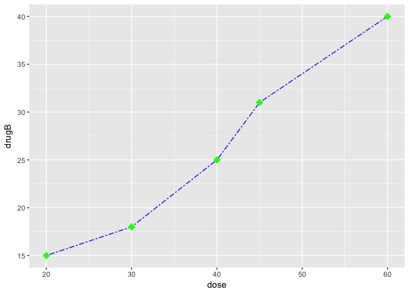
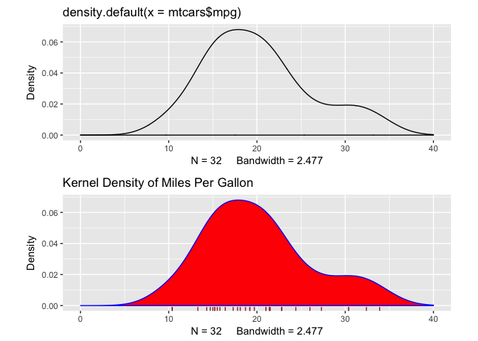
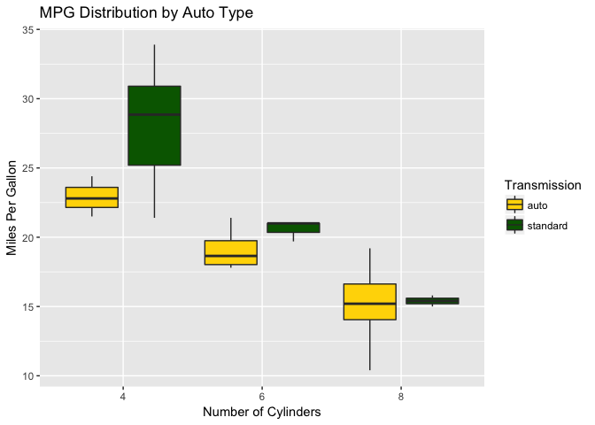
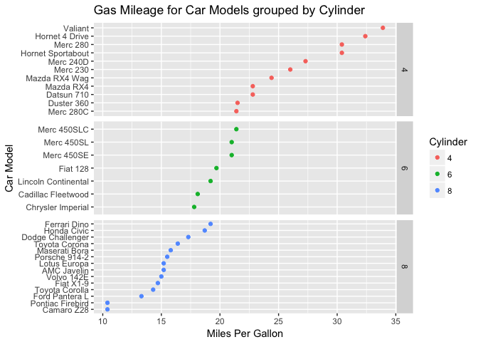

Homework \#3
================

Question 1: "Good" Data visualization
-------------------------------------

The Data visualization tool included in the citation below is a phenomenal resource to analyze the various sentiments of tweets, as well as aggregate patterns or common themes. This visualization tool is effective because there are several options to view the same information in drastically different settings -- a wordmap, a sentiment chart, a timeline, a tag cloud, a narrative, and a heatmap.

The Tweet Sentiment Visualization tool matches up with all of the criteria proposed by Tufte, save for "presenting many numbers in a small space".

Healey. (2011). Tweet Sentiment Visualization \[Scholarly project\]. In Tweet Sentiment Visualization. Retrieved February 7, 2018, from <https://www.csc2.ncsu.edu/faculty/healey/tweet_viz/tweet_app/>

Question 2: "Bad" Data visualization
------------------------------------

The data visualization found below does not do a great job of displaying meaninfgul information because by just showing the positive/negative reaction to topics on Twitter, the pie chart does not provide much material for thought-provoking discussion. Likewise, there are no "several" levels of detail in this visualization -- merely just the piechart. There are also minimal statistical and verbal descriptions of the dataset, rendering this source not the best visualization in regards to Tufte's standards.

Source: Arthur, C. (2011, July 19). How did they do? Twitter sentiment for 'Murdoch', 'hackgate' and 'Wendi Deng'. Retrieved February 07, 2018, from <https://www.theguardian.com/technology/blog/2011/jul/19/twitter-sentiment-analysis-wendi-deng>

Question 3: Data Visualization
------------------------------

I definitely intend on pursuing a web-based data visualization of the tweets that display the tweets on a spectrum, from the "most liberal" all the way to the "most conservative". In doing so, I would be displaying the tweets in a way that satisfies all of Tufte's standards. Furthermore, I would want to create a frequency chart of words most used by the different classifications in order to shed some light on the way the tone of different political ideologies is affected by the diction. Likewise, this would also satisfy all of Tufte's standards.

Question 4: Outliers
--------------------

The question of errors vs. outliers is a particularly interesting (and admittedly difficult) obstacle to approach when dealing with sentiment analysis. An "outlier" could be any tweet that "scores" 100% for "Republican" or "Democrat", while an "error" could be a tweet saying "Obamacare is the bane of our party's existence, the Dems always try to bring us down" that was classified as a "Democratic" tweet. Because I intend on having 5-6 different classifications (Democrat, Center-left, Moderate, Center-right, Republican, Libertarian) my best approach to reconciling the outlier vs. error debate would probably be to run the outcome of the classification through a check-process. Right now, I think the best way to approach this would be to use a voting algorithm that compares a variety of different classifiers to the tweet and chooses the class that appeared the most.

Question 5: Learning `ggplot2`
------------------------------

inputting the data:

``` r
library(ggplot2)
dose <- c(20, 30, 40, 45, 60)
drugA <- c(16, 20, 27, 40, 60)
drugB <- c(15, 18, 25, 31, 40)

opar <- par(no.readonly=TRUE)

# setting the dimensions of the graph (inches)
par(pin = c(2,3))

#lines = 2*width and symbols = 1.5*size
par(lwd = 2, cex = 1.5)

# making axis titles italicized and 75% default size
par(cex.axis = 0.75, font.axis = 3)

#creating a dataframe for the ggplot function for drugA
dataframe.a <- data.frame(dose, drugA)

#plotting drugA to be red circles
ggplot(dataframe.a, aes(dose, drugA)) + 
  geom_line(color = "red", linetype = "dashed") + 
  geom_point(color = "red", size = 2.5)
```


``` r
#creating a dataframe for the ggplot function for drugB
dataframe.b <- data.frame(dose, drugB)

ggplot(dataframe.a, aes(dose, drugB)) + 
  geom_line(color = "blue", linetype = "twodash") + 
  geom_point(color = "green", size = 4, shape =18, fill="blue")
```



``` r
par(opar)
```

Question 6: Listing 3.2, page 59 ggplot2
----------------------------------------

``` r
rm(list = ls())
x <- c(1:10)
y <- x
z <- 10/x
z
```

    ##  [1] 10.000000  5.000000  3.333333  2.500000  2.000000  1.666667  1.428571
    ##  [8]  1.250000  1.111111  1.000000

``` r
dataxyz <- data.frame(x,y,z)

ggplot(dataxyz, aes(x = x))+
  geom_line(aes(y= y), color = "red", linetype= "dotted") +
  geom_point(aes(x,y),color = "red", shape = 1, size = 3)+
  geom_line(aes(y = z), color = "blue",linetype = "dashed") +
  geom_point(aes(x,z), color = "blue", shape = 0, size = 3)+
  ggtitle("An Example of Creative Axes") +
  xlab("X values") + 
  ylab("Y + X") + 
  scale_y_continuous(breaks= seq(0,10,1), limits = c(0,10), sec.axis = sec_axis(~.*1,name = "Y = 10/X", breaks = round(z, digits = 2))) +
  scale_x_continuous(breaks= seq(0,10,2), limits = c(0,10)) +
  theme_bw() + 
  theme(panel.border = element_blank(), panel.grid.major = element_blank(),
panel.grid.minor = element_blank(), axis.line = element_line(colour = "black"))
```


Question 7: Listing 6.7, page 127
---------------------------------

I used the `gridExtra` package for faceting just because I found this to be the easiest way to organize the plots.

``` r
library(gridExtra)
par(mfrow=c(2,1))
par(pin = c(2.5,1))
plain.density <- ggplot(data.frame(mtcars$mpg), aes(x =mtcars$mpg))+  
  geom_density() + 
  xlab("N = 32     Bandwidth = 2.477") +
  ylab("Density")+
  scale_x_continuous(breaks= seq(0,40,10), limits = c(0,40)) + 
  ggtitle("density.default(x = mtcars$mpg)") +
  theme(
     plot.margin = margin(t = 0.25, r = 1, b= 0.25, l = 1, "cm")
  )
  
nice.density <- ggplot(data.frame(mtcars$mpg), aes(x =mtcars$mpg))+  
  geom_density(fill = "red", color = "blue") + 
  xlab("N = 32     Bandwidth = 2.477") +
  ylab("Density")+
  scale_x_continuous(breaks= seq(0,40,10), limits = c(0,40)) + 
  ggtitle("Kernel Density of Miles Per Gallon") + 
  geom_rug(color = "brown") + 
  theme(
     plot.margin = margin(t = 0.25, r = 1, b= 0.25, l = 1, "cm")
  )


grid.arrange(plain.density, nice.density, ncol = 1)
```



Question 8: Listing 6.9, page 131
---------------------------------

``` r
#factor created for number of cylinders in car
mtcars$cyl.f <- factor(mtcars$cyl,
                      levels=c(4,6,8),
                      labels=c("4","6","8"))


#factor for transmission type
mtcars$am.f <- factor(mtcars$am,
                     levels=c(0,1),
                     labels=c("auto", "standard"))

ggplot(data =mtcars, aes(y = mpg, x = cyl.f, fill = am.f)) +
  geom_boxplot(position = position_dodge(0.9)) + 
  scale_fill_manual(values = c("gold", "darkgreen")) +
  ylab("Miles Per Gallon") +
  ggtitle("MPG Distribution by Auto Type") + 
  xlab("Number of Cylinders") + 
  labs(fill= "Transmission")
```



Question 9: Listing 6.11 page 134
---------------------------------

``` r
library(ggplot2)
x <- mtcars[order(mtcars$mpg), ]

x$cyl <- factor(x$cyl)

#character vector regarding color that is determined by the value of cyl
x$color[x$cyl==4] <- "red"
x$color[x$cyl==6] <- "blue"
x$color[x$cyl==8] <- "darkgreen"


ggplot(data = mtcars, aes(x= mpg, y = reorder(row.names(mtcars),mpg), color =  factor(cyl))) + 
  geom_point() +
  facet_grid(cyl~., scales = "free_y") +
  ggtitle("Gas Mileage for Car Models grouped by Cylinder") +
  xlab("Miles Per Gallon") + 
  ylab("Car Model") +
  labs(color = "Cylinder")
```



Question 10: Feedback
---------------------

1.  Took me roughly 3 hours to complete the homework
2.  The homework was not terribly difficult at all. Working out the kinks of ggplot2 vs the original listing was a bit painful, but otherwise nothing was too difficult.
3.  The parts that I found useful were the reading of the material, and the exploration that I did in terms of removing parameters from the visualizations to see the subsequent effects on the graphs
4.  A fun, but challenging assignment overall.
