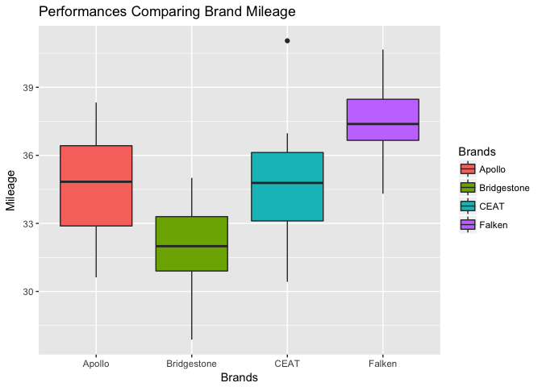
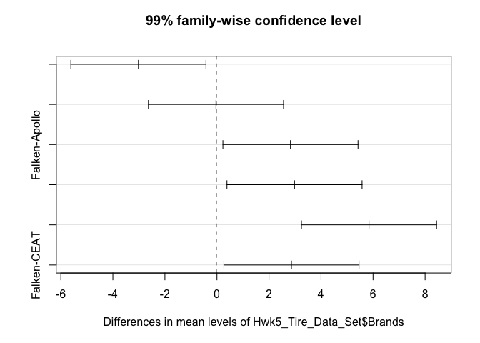
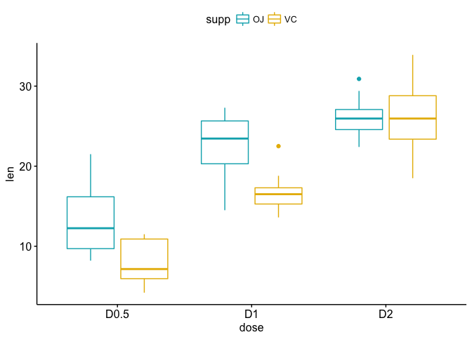
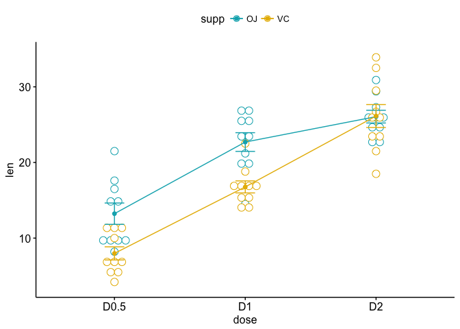
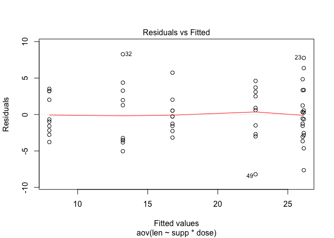
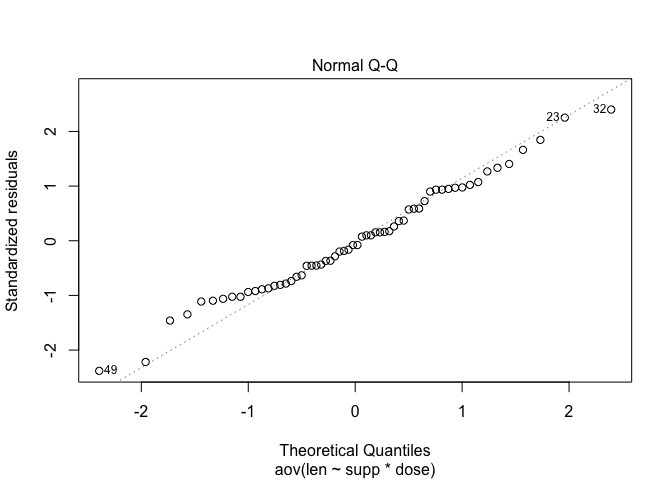

Homework \#5
================

Question 1: Tire Data Set
-------------------------

1.  construct a boxplot comparing the performances

``` r
library(readr)
library(ggplot2)
Hwk5_Tire_Data_Set <- read_csv("~/Downloads/Hwk5 Tire Data Set.csv")
```

    ## Parsed with column specification:
    ## cols(
    ##   Brands = col_character(),
    ##   Mileage = col_double()
    ## )

``` r
entire <- data.frame(Hwk5_Tire_Data_Set)
brands <- data.frame(Hwk5_Tire_Data_Set$Brands)

apollo.mileage <- entire[which(Hwk5_Tire_Data_Set$Brands == "Apollo"),][2]$Mileage
bridgestone.mileage <- entire[which(Hwk5_Tire_Data_Set$Brands == "Bridgestone"),][2]$Mileage
ceat.mileage <- entire[which(Hwk5_Tire_Data_Set$Brands == "CEAT"),][2]$Mileage
falken.mileage <- entire[which(Hwk5_Tire_Data_Set$Brands == "Falken"),][2]$Mileage


#fivenum returns min, lower quartile, median, upper quartile and maximum in that order
apollo.IQR <- IQR(apollo.mileage)
bridgestone.IQR <- IQR(bridgestone.mileage)
ceat.IQR <- IQR(ceat.mileage)
falken.mileage <- IQR(falken.mileage)

ggplot(data =Hwk5_Tire_Data_Set, aes(x = Brands, y = Mileage, fill = Brands)) +
  geom_boxplot(position = position_dodge(0.9)) +
  ggtitle("Performances Comparing Brand Mileage") 
```



1.  any outliers? where?

Yes there's an outlier in the data related to the CEAT tires. Unfortunately, I have tried for an incredible amount of time to write code that automatically labels the outlier (I talked to Will about it to brainstorm for solutions), but anyways, I was trying to create robust code that essentially labels outliers for any of the tire data. Below is the code I attempted to execute with the ggplot framework:

`geom_text(aes(label=ifelse((x=="Apollo"), Mileage,"")), hjust=1.1)`

1.  Perform one-way ANOVA analysis, report/interpret the results. State the explicit hypotheses (null and alternative) to test the findings

``` r
brandmileage.aov <- aov(Hwk5_Tire_Data_Set$Mileage ~ Hwk5_Tire_Data_Set$Brands, data = Hwk5_Tire_Data_Set)

summary(brandmileage.aov)
```

    ##                           Df Sum Sq Mean Sq F value   Pr(>F)    
    ## Hwk5_Tire_Data_Set$Brands  3  256.3   85.43   17.94 2.78e-08 ***
    ## Residuals                 56  266.6    4.76                     
    ## ---
    ## Signif. codes:  0 '***' 0.001 '**' 0.01 '*' 0.05 '.' 0.1 ' ' 1

**Null Hypothesis**: The mean mileage for all brands is the same **Alternative Hypothesis**: At least one brand is different in means from the rest.

result: because there is a very low p-value (&lt; 2.78e-08), we can assume that there is a difference in mileage between at least one tire brand and the others

1.  Perform Tukey's HSD test

``` r
TukeyHSD(brandmileage.aov)
```

    ##   Tukey multiple comparisons of means
    ##     95% family-wise confidence level
    ## 
    ## Fit: aov(formula = Hwk5_Tire_Data_Set$Mileage ~ Hwk5_Tire_Data_Set$Brands, data = Hwk5_Tire_Data_Set)
    ## 
    ## $`Hwk5_Tire_Data_Set$Brands`
    ##                           diff        lwr       upr     p adj
    ## Bridgestone-Apollo -3.01900000 -5.1288190 -0.909181 0.0020527
    ## CEAT-Apollo        -0.03792661 -2.1477456  2.071892 0.9999608
    ## Falken-Apollo       2.82553333  0.7157143  4.935352 0.0043198
    ## CEAT-Bridgestone    2.98107339  0.8712544  5.090892 0.0023806
    ## Falken-Bridgestone  5.84453333  3.7347143  7.954352 0.0000000
    ## Falken-CEAT         2.86345994  0.7536409  4.973279 0.0037424

1.  Plot Tukey results w/ 99% confidence level

``` r
plot(TukeyHSD(brandmileage.aov, conf.level = 0.99))
```



Question 2: Functions
---------------------

1.  Create a function that calculates z-scores for a vector of length n of test scores. Test it sufficiently to demonstrate that it is correct.

``` r
zscore_calc <- function(test_scores){
  #error conditions
  # 1. if there are any na values in the vector
  if(any(is.na(test_scores))){
    return("Please pass in a vector with test scores completely inputted")
  }
  # 2. if there are any values that are NOT numeric (fraction, decimal, integer)
  else if(!any(is.numeric(test_scores))){
    return("We'll need numbers to calculate... so pease give us numbers!")
  }
  
  #initializing size of vector beforehand to save time for large inputs
  zscore_vec <- numeric(length(test_scores))
  zmean <- mean(test_scores)
  zsd <- sd(test_scores)
  
  #making calls to function zscore that was made
  for(i in 1:length(test_scores))
    zscore_vec[i] <- zscore(test_scores[i], zmean, zsd)
    return(zscore_vec)  
  }

zscore<- function(value, mu, stand_dev){
  return((value-mu)/stand_dev)
}

zscore_calc(c(1,2,3,4,5))
```

    ## [1] -1.2649111 -0.6324555  0.0000000  0.6324555  1.2649111

``` r
#testing to see if decimals can be taken as well
zscore_calc(c(1,2,3,4,0.5))
```

    ## [1] -0.76827333 -0.06984303  0.62858727  1.32701756 -1.11748847

``` r
#testing to see if na values are detected / to check if length is 0
zscore_calc(c())
```

    ## Warning in is.na(test_scores): is.na() applied to non-(list or vector) of
    ## type 'NULL'

    ## [1] "We'll need numbers to calculate... so pease give us numbers!"

``` r
#testing to see if letters/character vars errors are detected
zscore_calc(c(1,2,3,4,"hiya"))
```

    ## [1] "We'll need numbers to calculate... so pease give us numbers!"

``` r
#testing for robustness
zscore_calc(c(70, 80, 90, 99, 60, 45))
```

    ## [1] -0.2015171  0.3022756  0.8060684  1.2594818 -0.7053098 -1.4609989

``` r
zscore_calc(c(10, 20, 40, 20, 10))
```

    ## [1] -0.8164966  0.0000000  1.6329932  0.0000000 -0.8164966

``` r
zscore_calc(c(51,54,65,75,85.333, 95, 94.5, 92, 72, 74, 83.7))
```

    ##  [1] -1.66226703 -1.46672921 -0.74975719 -0.09796445  0.57553299
    ##  [6]  1.20562104  1.17303140  1.01008321 -0.29350227 -0.16314372
    ## [11]  0.46909524

1.  Create a function that determines if a letter is a vowel or not.

``` r
vowelfun <- function(c){
  #error conditions
  # 1. if what's passed in is more than one letter in length
  if(nchar(c)>1){
    return("Please input only ONE letter")
  }
  # 2. if what's passed in is NOT a character
  else if(!is.character(c)){
    return("Please pass in a value of type CHARACTER")
  }
  # tolower to take care of any capitalized lettters. Could have done toUpper as well
  c = tolower(c)
  
  #variant of match function for many values
  c %in% c('a','e','i','o','u')
}

#test cases:

#checking to see if capitalized values work
vowelfun('A')
```

    ## [1] TRUE

``` r
#checking to see if non-character values pass
vowelfun(1)
```

    ## [1] "Please pass in a value of type CHARACTER"

``` r
# checking to see if values of length >1 are acceptable
vowelfun('aa')
```

    ## [1] "Please input only ONE letter"

``` r
# checking to see if consonant values fail
vowelfun('b')
```

    ## [1] FALSE

``` r
#checking to see if all the "true" values evaluate to TRUE
vowelfun('A')
```

    ## [1] TRUE

``` r
vowelfun('a')
```

    ## [1] TRUE

``` r
vowelfun('E')
```

    ## [1] TRUE

``` r
vowelfun('e')
```

    ## [1] TRUE

``` r
vowelfun('i')
```

    ## [1] TRUE

``` r
vowelfun('I')
```

    ## [1] TRUE

``` r
vowelfun('o')
```

    ## [1] TRUE

``` r
vowelfun('O')
```

    ## [1] TRUE

``` r
vowelfun('U')
```

    ## [1] TRUE

``` r
vowelfun('u')
```

    ## [1] TRUE

Question 3: ANOVA Tutorial
--------------------------

### Two-way ANOVA test hypotheses:

1.  There is no difference in means of factor A
2.  There is no difference in means of factor B
3.  There is no interaction between factors A and B

### Balanced Designs

``` r
my_data <- ToothGrowth
library("dplyr")
```

    ## 
    ## Attaching package: 'dplyr'

    ## The following objects are masked from 'package:stats':
    ## 
    ##     filter, lag

    ## The following objects are masked from 'package:base':
    ## 
    ##     intersect, setdiff, setequal, union

``` r
#Showing random sample

set.seed(1234)
dplyr::sample_n(my_data, 10)
```

    ##     len supp dose
    ## 7  11.2   VC  0.5
    ## 37  8.2   OJ  0.5
    ## 36 10.0   OJ  0.5
    ## 58 27.3   OJ  2.0
    ## 49 14.5   OJ  1.0
    ## 57 26.4   OJ  2.0
    ## 1   4.2   VC  0.5
    ## 13 15.2   VC  1.0
    ## 35 14.5   OJ  0.5
    ## 27 26.7   VC  2.0

``` r
str(my_data)
```

    ## 'data.frame':    60 obs. of  3 variables:
    ##  $ len : num  4.2 11.5 7.3 5.8 6.4 10 11.2 11.2 5.2 7 ...
    ##  $ supp: Factor w/ 2 levels "OJ","VC": 2 2 2 2 2 2 2 2 2 2 ...
    ##  $ dose: num  0.5 0.5 0.5 0.5 0.5 0.5 0.5 0.5 0.5 0.5 ...

Now we're converting "dose" into a factor (currently regarded as numeric variable)

``` r
my_data$dose <- factor(my_data$dose,
                       levels = c(0.5, 1, 2),
                       labels = c("D0.5", "D1", "D2"))
head(my_data)
```

    ##    len supp dose
    ## 1  4.2   VC D0.5
    ## 2 11.5   VC D0.5
    ## 3  7.3   VC D0.5
    ## 4  5.8   VC D0.5
    ## 5  6.4   VC D0.5
    ## 6 10.0   VC D0.5

Frequency table to check if tooth length depends on supp/dose

``` r
table(my_data$supp, my_data$dose)
```

    ##     
    ##      D0.5 D1 D2
    ##   OJ   10 10 10
    ##   VC   10 10 10

**Because the resulting table is a 2x3 design-cell table, this is considered ** *balanced*

``` r
library("ggpubr")
```

    ## Loading required package: magrittr

``` r
ggboxplot(my_data, 
          x= "dose", 
          y = "len", 
          color = "supp",
          palette = c("#00AFBB", "#E7B800"))
```



``` r
ggline(my_data, 
       x= "dose", 
       y = "len", 
       color = "supp",
       add = c("mean_se", "dotplot"),
       palette = c("#00AFBB", "#E7B800"))
```

    ## `stat_bindot()` using `bins = 30`. Pick better value with `binwidth`.



### Computing the Two-Way Anova Test

``` r
res.aov2 <- aov(len ~supp + dose, data = my_data)
summary(res.aov2)
```

    ##             Df Sum Sq Mean Sq F value   Pr(>F)    
    ## supp         1  205.4   205.4   14.02 0.000429 ***
    ## dose         2 2426.4  1213.2   82.81  < 2e-16 ***
    ## Residuals   56  820.4    14.7                     
    ## ---
    ## Signif. codes:  0 '***' 0.001 '**' 0.01 '*' 0.05 '.' 0.1 ' ' 1

From the above, we find that supp and dose are statistically significant, with dose being the *most* significant factor variable. This implies that a change in either `dose` or `supp` will result in a significant change in the mean tooth length.

This **additive model** implies that both `supp` and `dose` are completely independent. If there are interactions between the two then... follow below:

``` r
interaction_result <- aov(len ~supp* dose, data = my_data)
summary(interaction_result)
```

    ##             Df Sum Sq Mean Sq F value   Pr(>F)    
    ## supp         1  205.4   205.4  15.572 0.000231 ***
    ## dose         2 2426.4  1213.2  92.000  < 2e-16 ***
    ## supp:dose    2  108.3    54.2   4.107 0.021860 *  
    ## Residuals   54  712.1    13.2                     
    ## ---
    ## Signif. codes:  0 '***' 0.001 '**' 0.01 '*' 0.05 '.' 0.1 ' ' 1

When the interaction is NOT significant (in this case it is), it's recommended to use the additive model

### Interpreting the results

From the above statistics, we know that: \* the p-value of `supp` is 0.000429, meaning that the levels of `supp` are significantly associated with the tooth lengths

-   p-value of `dose` is &lt; 2e-16, meaning that levels of `dose` are significantly associated with the different tooth lengths

-   p-value of `supp*dose` (the interaction) is 0.02 --&gt; this implies that the relationships between `dose` and tooth length also depend on the supp method

``` r
require(dplyr)

group_by(my_data, supp, dose) %>%
  summarise(
    count = n(),
    mean = mean(len, na.rm = TRUE),
    sd = sd(len, na.rm = TRUE)
  )
```

    ## # A tibble: 6 x 5
    ## # Groups:   supp [?]
    ##   supp  dose  count  mean    sd
    ##   <fct> <fct> <int> <dbl> <dbl>
    ## 1 OJ    D0.5     10 13.2   4.46
    ## 2 OJ    D1       10 22.7   3.91
    ## 3 OJ    D2       10 26.1   2.66
    ## 4 VC    D0.5     10  7.98  2.75
    ## 5 VC    D1       10 16.8   2.52
    ## 6 VC    D2       10 26.1   4.80

``` r
model.tables(interaction_result, type = "means", se = TRUE)
```

    ## Tables of means
    ## Grand mean
    ##          
    ## 18.81333 
    ## 
    ##  supp 
    ## supp
    ##     OJ     VC 
    ## 20.663 16.963 
    ## 
    ##  dose 
    ## dose
    ##   D0.5     D1     D2 
    ## 10.605 19.735 26.100 
    ## 
    ##  supp:dose 
    ##     dose
    ## supp D0.5  D1    D2   
    ##   OJ 13.23 22.70 26.06
    ##   VC  7.98 16.77 26.14
    ## 
    ## Standard errors for differences of means
    ##           supp   dose supp:dose
    ##         0.9376 1.1484    1.6240
    ## replic.     30     20        10

### Multiple Pariwise-Comparison between means of groups

#### Using Tukey HSD for multiple pairwise-comparisons

``` r
TukeyHSD(interaction_result, which = "dose")
```

    ##   Tukey multiple comparisons of means
    ##     95% family-wise confidence level
    ## 
    ## Fit: aov(formula = len ~ supp * dose, data = my_data)
    ## 
    ## $dose
    ##           diff       lwr       upr   p adj
    ## D1-D0.5  9.130  6.362488 11.897512 0.0e+00
    ## D2-D0.5 15.495 12.727488 18.262512 0.0e+00
    ## D2-D1    6.365  3.597488  9.132512 2.7e-06

#### Multiple comparisons using `multcomp` package

``` r
library(multcomp)
```

    ## Loading required package: mvtnorm

    ## Loading required package: survival

    ## Loading required package: TH.data

    ## Loading required package: MASS

    ## 
    ## Attaching package: 'MASS'

    ## The following object is masked from 'package:dplyr':
    ## 
    ##     select

    ## 
    ## Attaching package: 'TH.data'

    ## The following object is masked from 'package:MASS':
    ## 
    ##     geyser

``` r
summary(glht(res.aov2, linfct = mcp(dose = "Tukey")))
```

    ## 
    ##   Simultaneous Tests for General Linear Hypotheses
    ## 
    ## Multiple Comparisons of Means: Tukey Contrasts
    ## 
    ## 
    ## Fit: aov(formula = len ~ supp + dose, data = my_data)
    ## 
    ## Linear Hypotheses:
    ##                Estimate Std. Error t value Pr(>|t|)    
    ## D1 - D0.5 == 0    9.130      1.210   7.543   <1e-05 ***
    ## D2 - D0.5 == 0   15.495      1.210  12.802   <1e-05 ***
    ## D2 - D1 == 0      6.365      1.210   5.259   <1e-05 ***
    ## ---
    ## Signif. codes:  0 '***' 0.001 '**' 0.01 '*' 0.05 '.' 0.1 ' ' 1
    ## (Adjusted p values reported -- single-step method)

#### Pariwise t-test

``` r
pairwise.t.test(my_data$len, 
                my_data$dose,
                p.adjust.method = "BH")
```

    ## 
    ##  Pairwise comparisons using t tests with pooled SD 
    ## 
    ## data:  my_data$len and my_data$dose 
    ## 
    ##    D0.5    D1     
    ## D1 1.0e-08 -      
    ## D2 4.4e-16 1.4e-05
    ## 
    ## P value adjustment method: BH

### Check ANOVA assumptions: test validity

#### Checking homogeneity of variance assumption

``` r
# Test 1: Homogeneity of variances

plot(interaction_result, 1)
```



In above call, there are a couple of outliers, which can definitely affect the normality of any given curve In the future, we'll remove outliers to meet test assumptions

Now, using **Levene's test** to check the homogeneity of variances

``` r
require(car)
```

    ## Loading required package: car

    ## 
    ## Attaching package: 'car'

    ## The following object is masked from 'package:dplyr':
    ## 
    ##     recode

``` r
leveneTest(len~supp*dose, data = my_data)
```

    ## Levene's Test for Homogeneity of Variance (center = median)
    ##       Df F value Pr(>F)
    ## group  5  1.7086 0.1484
    ##       54

### Checking the normality assumption

``` r
plot(interaction_result, 2)
```



Because there aren't any extreme outliers, normality can be assumed

running the **Shapiro-Wilk test**

``` r
aov_residuals <- residuals(object = interaction_result)

shapiro.test(x = aov_residuals)
```

    ## 
    ##  Shapiro-Wilk normality test
    ## 
    ## data:  aov_residuals
    ## W = 0.98499, p-value = 0.6694

### Computing two-way ANOVA tests for unbalanced designs

``` r
require(car)
my_anova <- aov(len ~ supp * dose, data = my_data)
Anova(my_anova, type = "III")
```

    ## Anova Table (Type III tests)
    ## 
    ## Response: len
    ##              Sum Sq Df F value    Pr(>F)    
    ## (Intercept) 1750.33  1 132.730 3.603e-16 ***
    ## supp         137.81  1  10.450  0.002092 ** 
    ## dose         885.26  2  33.565 3.363e-10 ***
    ## supp:dose    108.32  2   4.107  0.021860 *  
    ## Residuals    712.11 54                      
    ## ---
    ## Signif. codes:  0 '***' 0.001 '**' 0.01 '*' 0.05 '.' 0.1 ' ' 1
