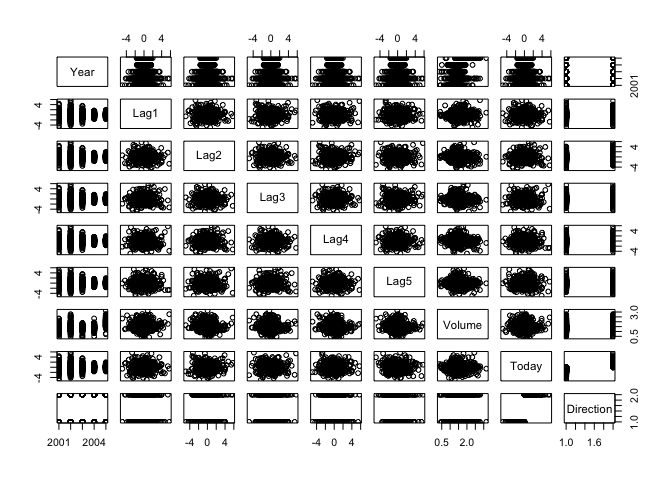
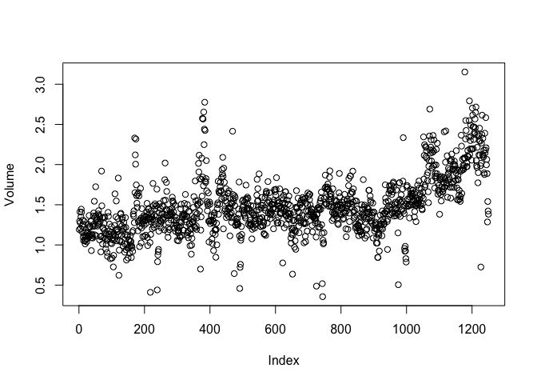
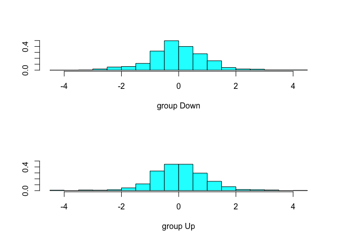

Homework \#7
================

Question 1: Lab 4.6.1
---------------------

``` r
library(ISLR)
names(Smarket)
```

    ## [1] "Year"      "Lag1"      "Lag2"      "Lag3"      "Lag4"      "Lag5"     
    ## [7] "Volume"    "Today"     "Direction"

``` r
dim(Smarket)
```

    ## [1] 1250    9

``` r
summary(Smarket)
```

    ##       Year           Lag1                Lag2          
    ##  Min.   :2001   Min.   :-4.922000   Min.   :-4.922000  
    ##  1st Qu.:2002   1st Qu.:-0.639500   1st Qu.:-0.639500  
    ##  Median :2003   Median : 0.039000   Median : 0.039000  
    ##  Mean   :2003   Mean   : 0.003834   Mean   : 0.003919  
    ##  3rd Qu.:2004   3rd Qu.: 0.596750   3rd Qu.: 0.596750  
    ##  Max.   :2005   Max.   : 5.733000   Max.   : 5.733000  
    ##       Lag3                Lag4                Lag5         
    ##  Min.   :-4.922000   Min.   :-4.922000   Min.   :-4.92200  
    ##  1st Qu.:-0.640000   1st Qu.:-0.640000   1st Qu.:-0.64000  
    ##  Median : 0.038500   Median : 0.038500   Median : 0.03850  
    ##  Mean   : 0.001716   Mean   : 0.001636   Mean   : 0.00561  
    ##  3rd Qu.: 0.596750   3rd Qu.: 0.596750   3rd Qu.: 0.59700  
    ##  Max.   : 5.733000   Max.   : 5.733000   Max.   : 5.73300  
    ##      Volume           Today           Direction 
    ##  Min.   :0.3561   Min.   :-4.922000   Down:602  
    ##  1st Qu.:1.2574   1st Qu.:-0.639500   Up  :648  
    ##  Median :1.4229   Median : 0.038500             
    ##  Mean   :1.4783   Mean   : 0.003138             
    ##  3rd Qu.:1.6417   3rd Qu.: 0.596750             
    ##  Max.   :3.1525   Max.   : 5.733000

``` r
pairs(Smarket)
```



``` r
cor(Smarket[,-9])
```

    ##              Year         Lag1         Lag2         Lag3         Lag4
    ## Year   1.00000000  0.029699649  0.030596422  0.033194581  0.035688718
    ## Lag1   0.02969965  1.000000000 -0.026294328 -0.010803402 -0.002985911
    ## Lag2   0.03059642 -0.026294328  1.000000000 -0.025896670 -0.010853533
    ## Lag3   0.03319458 -0.010803402 -0.025896670  1.000000000 -0.024051036
    ## Lag4   0.03568872 -0.002985911 -0.010853533 -0.024051036  1.000000000
    ## Lag5   0.02978799 -0.005674606 -0.003557949 -0.018808338 -0.027083641
    ## Volume 0.53900647  0.040909908 -0.043383215 -0.041823686 -0.048414246
    ## Today  0.03009523 -0.026155045 -0.010250033 -0.002447647 -0.006899527
    ##                Lag5      Volume        Today
    ## Year    0.029787995  0.53900647  0.030095229
    ## Lag1   -0.005674606  0.04090991 -0.026155045
    ## Lag2   -0.003557949 -0.04338321 -0.010250033
    ## Lag3   -0.018808338 -0.04182369 -0.002447647
    ## Lag4   -0.027083641 -0.04841425 -0.006899527
    ## Lag5    1.000000000 -0.02200231 -0.034860083
    ## Volume -0.022002315  1.00000000  0.014591823
    ## Today  -0.034860083  0.01459182  1.000000000

``` r
attach(Smarket)
plot(Volume)
```



Question 2: Lab 4.6.2
---------------------

``` r
glm.fits = glm(Direction~Lag1+Lag2+Lag3+Lag4+Lag5+Volume, data = Smarket, family = binomial)
summary(glm.fits)
```

    ## 
    ## Call:
    ## glm(formula = Direction ~ Lag1 + Lag2 + Lag3 + Lag4 + Lag5 + 
    ##     Volume, family = binomial, data = Smarket)
    ## 
    ## Deviance Residuals: 
    ##    Min      1Q  Median      3Q     Max  
    ## -1.446  -1.203   1.065   1.145   1.326  
    ## 
    ## Coefficients:
    ##              Estimate Std. Error z value Pr(>|z|)
    ## (Intercept) -0.126000   0.240736  -0.523    0.601
    ## Lag1        -0.073074   0.050167  -1.457    0.145
    ## Lag2        -0.042301   0.050086  -0.845    0.398
    ## Lag3         0.011085   0.049939   0.222    0.824
    ## Lag4         0.009359   0.049974   0.187    0.851
    ## Lag5         0.010313   0.049511   0.208    0.835
    ## Volume       0.135441   0.158360   0.855    0.392
    ## 
    ## (Dispersion parameter for binomial family taken to be 1)
    ## 
    ##     Null deviance: 1731.2  on 1249  degrees of freedom
    ## Residual deviance: 1727.6  on 1243  degrees of freedom
    ## AIC: 1741.6
    ## 
    ## Number of Fisher Scoring iterations: 3

``` r
summary(glm.fits)$coef
```

    ##                 Estimate Std. Error    z value  Pr(>|z|)
    ## (Intercept) -0.126000257 0.24073574 -0.5233966 0.6006983
    ## Lag1        -0.073073746 0.05016739 -1.4565986 0.1452272
    ## Lag2        -0.042301344 0.05008605 -0.8445733 0.3983491
    ## Lag3         0.011085108 0.04993854  0.2219750 0.8243333
    ## Lag4         0.009358938 0.04997413  0.1872757 0.8514445
    ## Lag5         0.010313068 0.04951146  0.2082966 0.8349974
    ## Volume       0.135440659 0.15835970  0.8552723 0.3924004

``` r
summary(glm.fits)$coef[,4]
```

    ## (Intercept)        Lag1        Lag2        Lag3        Lag4        Lag5 
    ##   0.6006983   0.1452272   0.3983491   0.8243333   0.8514445   0.8349974 
    ##      Volume 
    ##   0.3924004

``` r
glm.probs = predict(glm.fits, type = "response")
glm.probs[1:10]
```

    ##         1         2         3         4         5         6         7 
    ## 0.5070841 0.4814679 0.4811388 0.5152224 0.5107812 0.5069565 0.4926509 
    ##         8         9        10 
    ## 0.5092292 0.5176135 0.4888378

``` r
contrasts(Direction)
```

    ##      Up
    ## Down  0
    ## Up    1

``` r
glm.pred = rep("Down",1250)
glm.pred[glm.probs>0.5]= "Up"

table(glm.pred,Direction)
```

    ##         Direction
    ## glm.pred Down  Up
    ##     Down  145 141
    ##     Up    457 507

``` r
mean(glm.pred == Direction)
```

    ## [1] 0.5216

``` r
train = (Year<2005)
Smarket.2005 = Smarket[!train, ]
dim(Smarket.2005)
```

    ## [1] 252   9

``` r
Direction.2005 = Direction[!train]

glm.fits.train=glm(Direction~Lag1+Lag2+Lag3+Lag4+Lag5+Volume ,
data=Smarket ,family=binomial ,subset=train)

glm.probs.train=predict(glm.fits.train,Smarket.2005, type="response")

glm.pred.train = rep("Down", 252)
glm.pred.train[glm.probs.train>0.5] = "Up"
table(glm.pred.train, Direction.2005)
```

    ##               Direction.2005
    ## glm.pred.train Down Up
    ##           Down   77 97
    ##           Up     34 44

``` r
mean(glm.pred == Direction.2005)
```

    ## Warning in is.na(e1) | is.na(e2): longer object length is not a multiple of
    ## shorter object length

    ## Warning in `==.default`(glm.pred, Direction.2005): longer object length is
    ## not a multiple of shorter object length

    ## [1] 0.5352

``` r
mean(glm.pred.train!=Direction.2005)
```

    ## [1] 0.5198413

``` r
glm.fits.refine=glm(Direction~Lag1+Lag2 ,data=Smarket ,family=binomial ,
subset=train)
glm.probs.refine = predict(glm.fits.refine, Smarket.2005,type = "response")
glm.pred.refine = rep("Down",252)
glm.pred.refine[glm.probs.refine > 0.5] = "Up"
table(glm.pred.refine, Direction.2005)
```

    ##                Direction.2005
    ## glm.pred.refine Down  Up
    ##            Down   35  35
    ##            Up     76 106

``` r
mean(glm.pred.refine == Direction.2005)
```

    ## [1] 0.5595238

``` r
predict(glm.fits.refine, newdata = data.frame(Lag1 = c(1.2,1.5),Lag2 = c(1.1,-0.8)), type = "response")
```

    ##         1         2 
    ## 0.4791462 0.4960939

Question 3: Lab 4.6.3
---------------------

``` r
library(MASS)
lda.fit = lda(Direction~Lag1 + Lag2, data = Smarket,subset = train)
lda.fit
```

    ## Call:
    ## lda(Direction ~ Lag1 + Lag2, data = Smarket, subset = train)
    ## 
    ## Prior probabilities of groups:
    ##     Down       Up 
    ## 0.491984 0.508016 
    ## 
    ## Group means:
    ##             Lag1        Lag2
    ## Down  0.04279022  0.03389409
    ## Up   -0.03954635 -0.03132544
    ## 
    ## Coefficients of linear discriminants:
    ##             LD1
    ## Lag1 -0.6420190
    ## Lag2 -0.5135293

``` r
plot(lda.fit)
```



``` r
lda.pred = predict(lda.fit, Smarket.2005)
names(lda.pred)
```

    ## [1] "class"     "posterior" "x"

``` r
lda.class = lda.pred$class
table(lda.class, Direction.2005)
```

    ##          Direction.2005
    ## lda.class Down  Up
    ##      Down   35  35
    ##      Up     76 106

``` r
mean(lda.class == Direction.2005)
```

    ## [1] 0.5595238

``` r
sum(lda.pred$posterior[,1] >= 0.5)
```

    ## [1] 70

``` r
sum(lda.pred$posterior[,1] <0.5)
```

    ## [1] 182

``` r
lda.pred$posterior[1:20,1]
```

    ##       999      1000      1001      1002      1003      1004      1005 
    ## 0.4901792 0.4792185 0.4668185 0.4740011 0.4927877 0.4938562 0.4951016 
    ##      1006      1007      1008      1009      1010      1011      1012 
    ## 0.4872861 0.4907013 0.4844026 0.4906963 0.5119988 0.4895152 0.4706761 
    ##      1013      1014      1015      1016      1017      1018 
    ## 0.4744593 0.4799583 0.4935775 0.5030894 0.4978806 0.4886331

``` r
lda.class[1:20]
```

    ##  [1] Up   Up   Up   Up   Up   Up   Up   Up   Up   Up   Up   Down Up   Up  
    ## [15] Up   Up   Up   Down Up   Up  
    ## Levels: Down Up

``` r
sum(lda.pred$posterior[,1]>0.9)
```

    ## [1] 0

Question 4: Lab 4.6.4
---------------------

``` r
qda.fit=qda(Direction~Lag1+Lag2 ,data=Smarket ,subset=train)
qda.fit
```

    ## Call:
    ## qda(Direction ~ Lag1 + Lag2, data = Smarket, subset = train)
    ## 
    ## Prior probabilities of groups:
    ##     Down       Up 
    ## 0.491984 0.508016 
    ## 
    ## Group means:
    ##             Lag1        Lag2
    ## Down  0.04279022  0.03389409
    ## Up   -0.03954635 -0.03132544

``` r
qda.class=predict (qda.fit ,Smarket.2005)$class
table(qda.class,Direction.2005)
```

    ##          Direction.2005
    ## qda.class Down  Up
    ##      Down   30  20
    ##      Up     81 121

``` r
mean(qda.class==Direction.2005)
```

    ## [1] 0.5992063

Question 5: Lab 4.6.5
---------------------

``` r
library(class)
train.X = cbind(Lag1, Lag2)[train,]
test.X = cbind(Lag1, Lag2)[!train,]
train.Direction = Direction[train]

set.seed(1)
knn.pred = knn(train.X, test.X, train.Direction, k =1)
table(knn.pred, Direction.2005)
```

    ##         Direction.2005
    ## knn.pred Down Up
    ##     Down   43 58
    ##     Up     68 83

``` r
knn.pred.3 = knn(train.X, test.X, train.Direction, k =1)
table(knn.pred.3, Direction.2005)
```

    ##           Direction.2005
    ## knn.pred.3 Down Up
    ##       Down   43 58
    ##       Up     68 83

``` r
mean(knn.pred.3 == Direction.2005)
```

    ## [1] 0.5

Question 6: Project Update
--------------------------

### Project goal: Tracking the changes in Political Discourse Online

Initially, my project was intended to create a multi-class classifier to measure political sentiment. However, as I'm doing a similar project for another data science class that I'm currently taking, I figured that it would be ideal for my data science education to pursue a drastically different project in order to diversify my experience.

As such, my project will be a deep-dive into the evolution of political discourse on social media platforms. In other words, I want to build a dashboard that essentially measures how the vocabulary used by the Democratic Party and the Republican Party has changed since the 2008 election. Given today's hyper-polarization, I thought that it would be an interesting experiment to analyze how our public figures have either heightened in their radical views or neutralized.

#### 1. <span style="color:red"> Why this is important </span>

My motivation behind any technology-based project that I approach is to merge the worlds of policy and technology. In this specific example, I think it's imperative to truly understand the language that is used by our public figures. Likewise, due to our current polarization, there are many people both in the government and in the public that are calling for some approach to breaking such polarity. As such, conducting a retrospective analysis would be helpful in understanding exactly how the polarization came about and cultivating insights regarding how to minimize the divide.

#### 2. <span style="color: red"> Specific Research Question </span>

How has the language used by the Democratic Party, the Republican Party, and their respective candidates through social media transformed since the 2008 election?

#### 3. <span style="color: red"> Datasets </span>

I've written a Twitter-based web-scraper in Python that continuously pulls tweets from the timelines of prominent Democratic and Republican figures, their respective party conventions, and the actual party's timelines. The code plugs into Twitter using the Twitter API and the Python 'tweepy' framework. Because there is a limit as to how often an individual can access Twitter's API, I've created the script such that every 15 minutes, the code makes a call to the Twitter API to pull in more tweets which, in the end, is the data that this project is predicated on.

#### 4. <span style="color:red"> Status</span>

I'm currently still getting familiar with Natural Language Processing in R in order to perform any types of data analyses on my data. I'm currently looking at the tm, NLP, openNLP, and tf-idf R packages to build some type of functional understanding of NLP in R.

I plan on using some variant of cluster analysis on the corpus of text in order to look at *exactly how* the vocabulary is grouped together. Likewise, I also want to create a dashboard that offers year-by-year views, overlaid on top of a timeline plotting any significant events that occurred in the respective years, as the vocabulary from politicians is inevitably affected by such events.

Furthermore, I'm also considering using a sentiment analysis package to display trivial positive/negative sentiment-related statistics to display responses to various issues using the ['SentimentAnalysis Package'](%22https://github.com/sfeuerriegel/SentimentAnalysis%22).
