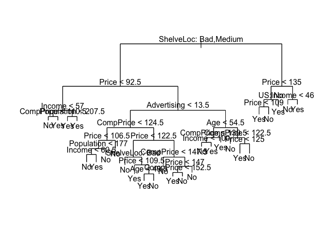
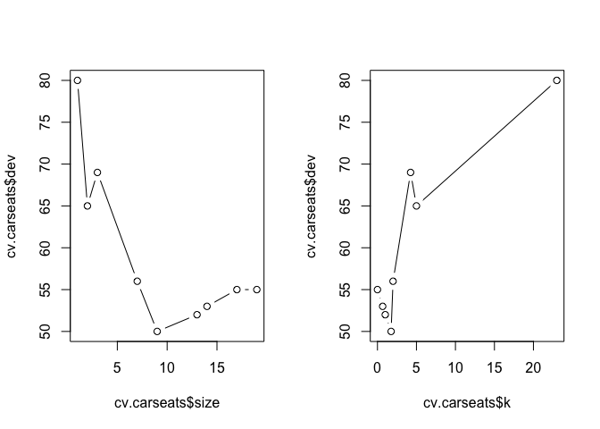
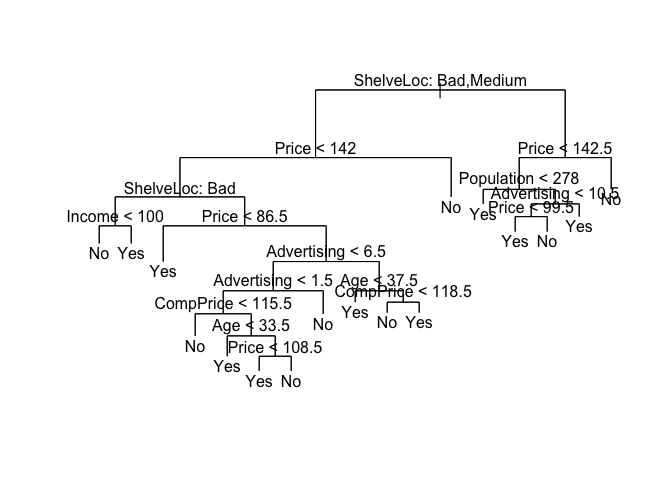
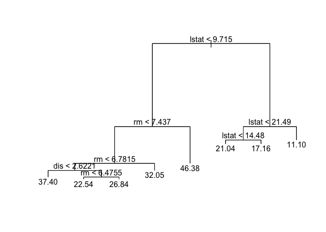
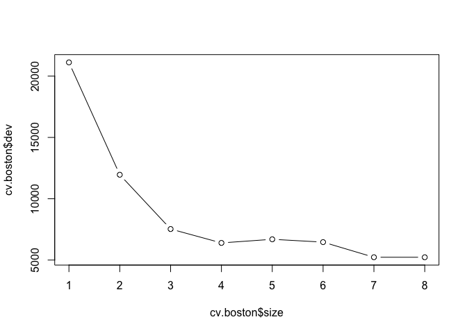
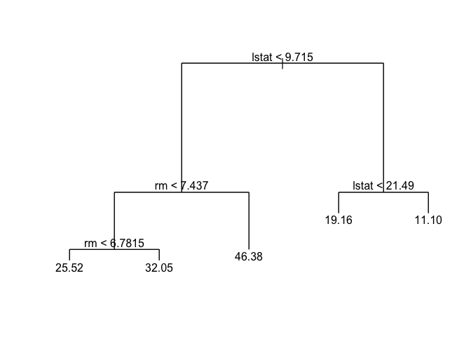
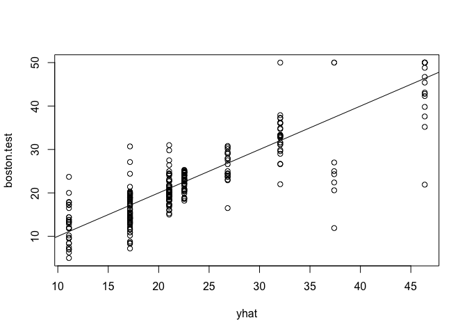
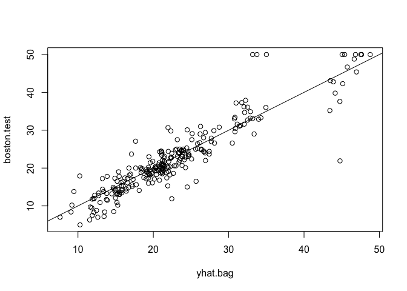
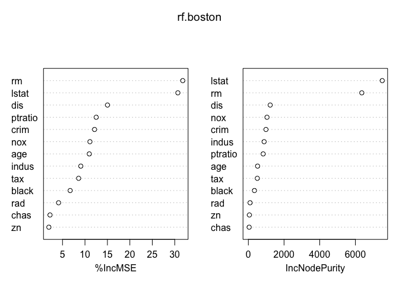
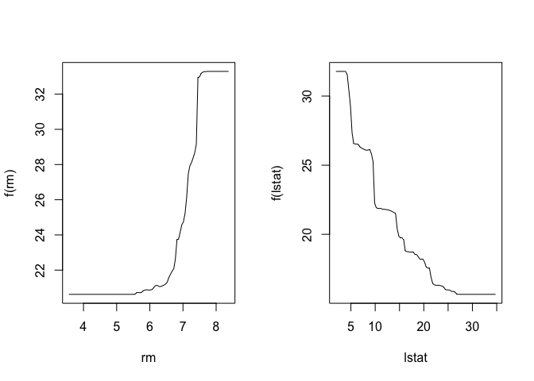

Sridhar Sriram HW\#8
================

<span style="color:red"> Note </span>
=====================================

This submission is late because I've spent the better half of the past couple of days troubleshooting an issue that arises when I try to install the "randomForest" package. Essentially, the package would not install due to issues with the file path.

Below are all of the links that I visited:

[the link that solved all of my issues](https://stackoverflow.com/questions/23916219/os-x-package-installation-depends-on-gfortran-4-8)

[link 1 that gave me hell](https://stackoverflow.com/questions/35716411/r-cannot-find-package)

[link 2 that did nothing](https://cran.r-project.org/web/packages/randomForest/index.html)

[link 3 that also did nothing](https://www.tutorialspoint.com/r/r_random_forest.htm)

[link 4 that was useless](http://r.789695.n4.nabble.com/installation-of-package-quot-randomForest-quot-failed-td798175.html)

[link 5A that led me nowhere](https://stackoverflow.com/questions/36078820/random-forest-installation-fails)

[link 5B that also led me nowhere](https://unix.stackexchange.com/questions/175851/how-to-permanently-enable-scl-centos-6-4)

[link 6 that took me to the origins of randomForest but I still was lost](https://www.stat.berkeley.edu/~breiman/RandomForests/)

[link 7 that basically broke my confidence](https://stackoverflow.com/questions/27893230/installation-of-package-file-path-had-non-zero-exit-status-in-r)

So again, I apologize for the tardiness of my submission, but I only literally just found out the issue at 1:45pm in class, after virtually banging my head on the proverbial walls of life

Lab 8.3.1: Fitting Classification Trees
---------------------------------------

#### <span style="color:blue">Working through fitting classification trees</span>

``` r
#install.packages("tree")
library(tree)
library(ISLR)
attach(Carseats)

High = ifelse(Sales <= 8, "No", "Yes")

Carseats = data.frame(Carseats, High)
```

#### <span style="color:blue">Now, using tree() to fit classification tree for predicting "High" status </span>

``` r
tree.carseats = tree(High~.-Sales, Carseats)
summary(tree.carseats)
```

    ## 
    ## Classification tree:
    ## tree(formula = High ~ . - Sales, data = Carseats)
    ## Variables actually used in tree construction:
    ## [1] "ShelveLoc"   "Price"       "Income"      "CompPrice"   "Population" 
    ## [6] "Advertising" "Age"         "US"         
    ## Number of terminal nodes:  27 
    ## Residual mean deviance:  0.4575 = 170.7 / 373 
    ## Misclassification error rate: 0.09 = 36 / 400

``` r
plot(tree.carseats)
text(tree.carseats, pretty = 0)
```



#### <span style="color:blue">Creating the test/train sets</span>

``` r
set.seed(2)
train = sample(1:nrow(Carseats),200)

Carseats.test = Carseats[-train,]

High.test= High[-train]

tree.carseats = tree(High~.-Sales, Carseats, subset = train)

tree.pred = predict(tree.carseats, Carseats.test, type = "class")

table(tree.pred,High.test)
```

    ##          High.test
    ## tree.pred No Yes
    ##       No  86  27
    ##       Yes 30  57

``` r
cat("Success rate of: ",(86+57)/(86+57+27+30)*100)
```

    ## Success rate of:  71.5

**Pruning Classification Trees**: The act of removing sectinos of the tree with little classification power

#### <span style="color:blue">We'll first cross-validate to check for the optimal sizes </span>

-   Because at size 9, there is an error-rate of only 50 (the minimum), we should reduce to a 9-node tree

below: `dev` corresponds to the cross-validation error rate

``` r
set.seed(3)

cv.carseats = cv.tree(tree.carseats, FUN = prune.misclass)

names(cv.carseats)
```

    ## [1] "size"   "dev"    "k"      "method"

``` r
cv.carseats
```

    ## $size
    ## [1] 19 17 14 13  9  7  3  2  1
    ## 
    ## $dev
    ## [1] 55 55 53 52 50 56 69 65 80
    ## 
    ## $k
    ## [1]       -Inf  0.0000000  0.6666667  1.0000000  1.7500000  2.0000000
    ## [7]  4.2500000  5.0000000 23.0000000
    ## 
    ## $method
    ## [1] "misclass"
    ## 
    ## attr(,"class")
    ## [1] "prune"         "tree.sequence"

``` r
par(mfrow = c(1,2))

plot(cv.carseats$size, cv.carseats$dev, type="b")
plot(cv.carseats$k, cv.carseats$dev, type="b")
```



#### <span style="color:blue">Now, we want to obtain the reduced tree using pruning</span>

``` r
prune.carseats = prune.misclass(tree.carseats,best = 9)

plot(prune.carseats)
text(prune.carseats,pretty = 0)
```


#### <span style="color:blue">Checking to see how good the pruning method works on test data </span>

``` r
tree.pred=predict(prune.carseats,Carseats.test, type = "class")

table(tree.pred, High.test)
```

    ##          High.test
    ## tree.pred No Yes
    ##       No  94  24
    ##       Yes 22  60

``` r
cat("Success rate of: ",(94+60)/(96+60+22+24))
```

    ## Success rate of:  0.7623762

**As is indicated, our accuracy with prediction/classification has gone up**

#### <span style="color:blue">Increasing the size of the tree reduces the accuracy:</span>

``` r
prune.carseats = prune.misclass(tree.carseats,best = 15)

plot(prune.carseats)
text(prune.carseats,pretty = 0)
```



``` r
tree.pred=predict(prune.carseats,Carseats.test, type = "class")

table(tree.pred, High.test)
```

    ##          High.test
    ## tree.pred No Yes
    ##       No  86  22
    ##       Yes 30  62

``` r
cat("Success rate of: ",(86+62)/(200))
```

    ## Success rate of:  0.74

Lab 8.3.2: Fitting Regression Trees
-----------------------------------

``` r
library(MASS)
set.seed(1)

train = sample(1:nrow(Boston),nrow(Boston)/2)
tree.boston = tree(medv~.,Boston, subset=train)
summary(tree.boston)
```

    ## 
    ## Regression tree:
    ## tree(formula = medv ~ ., data = Boston, subset = train)
    ## Variables actually used in tree construction:
    ## [1] "lstat" "rm"    "dis"  
    ## Number of terminal nodes:  8 
    ## Residual mean deviance:  12.65 = 3099 / 245 
    ## Distribution of residuals:
    ##      Min.   1st Qu.    Median      Mean   3rd Qu.      Max. 
    ## -14.10000  -2.04200  -0.05357   0.00000   1.96000  12.60000

#### <span style="color:purple"> Plotting the generated data </span>

``` r
plot(tree.boston)
text(tree.boston, pretty = 0)
```



#### <span style="color:purple">Cross-validation</span>

``` r
cv.boston = cv.tree(tree.boston)
cv.boston
```

    ## $size
    ## [1] 8 7 6 5 4 3 2 1
    ## 
    ## $dev
    ## [1]  5226.322  5228.360  6462.626  6692.615  6397.438  7529.846 11958.691
    ## [8] 21118.139
    ## 
    ## $k
    ## [1]      -Inf  255.6581  451.9272  768.5087  818.8885 1559.1264 4276.5803
    ## [8] 9665.3582
    ## 
    ## $method
    ## [1] "deviance"
    ## 
    ## attr(,"class")
    ## [1] "prune"         "tree.sequence"

``` r
plot(cv.boston$size, cv.boston$dev, type = 'b')
```



#### <span style="color:purple">Pruning</span>

I'm not entirely sure why the lab in instructs us to prune the tree into a 5-node tree when it's evident that a 7-node tree yields the least amount of errors.

``` r
prune.boston = prune.tree(tree.boston,best=5)
plot(prune.boston)
text(prune.boston,pretty = 0)
```



#### <span style="color:purple">Testing</span>

``` r
yhat = predict(tree.boston, newdata = Boston[-train,])
boston.test = Boston[-train, "medv"]
plot(yhat, boston.test)
abline(0,1)
```



``` r
mean((yhat-boston.test)^2)
```

    ## [1] 25.04559

**Interpretation:**

-   This model makes predictions that are within $5005 of the true median home value \#\# Lab 8.3.3: Bagging and Random Forests

Lab 8.3.3: Bagging and Random Forests
-------------------------------------

``` r
#install.packages("randomForest")
library(randomForest)
```

    ## randomForest 4.6-14

    ## Type rfNews() to see new features/changes/bug fixes.

``` r
set.seed(1)
bag.boston = randomForest(medv~.,data = Boston, subset = train, mtry=13, importance = TRUE)

bag.boston
```

    ## 
    ## Call:
    ##  randomForest(formula = medv ~ ., data = Boston, mtry = 13, importance = TRUE,      subset = train) 
    ##                Type of random forest: regression
    ##                      Number of trees: 500
    ## No. of variables tried at each split: 13
    ## 
    ##           Mean of squared residuals: 11.15723
    ##                     % Var explained: 86.49

``` r
yhat.bag = predict(bag.boston, newdata=Boston[-train,])
plot(yhat.bag, boston.test)
abline(0,1)
```



``` r
mean((yhat.bag - boston.test)^2)
```

    ## [1] 13.50808

``` r
set.seed(1)
rf.boston = randomForest(medv~., data= Boston, subset = train, mtry = 6, importance = TRUE)

yhat.rf = predict(rf.boston, newdata = Boston[-train,])
mean((yhat.rf-boston.test)^2)
```

    ## [1] 11.66454

``` r
importance(rf.boston)
```

    ##           %IncMSE IncNodePurity
    ## crim    12.132320     986.50338
    ## zn       1.955579      57.96945
    ## indus    9.069302     882.78261
    ## chas     2.210835      45.22941
    ## nox     11.104823    1044.33776
    ## rm      31.784033    6359.31971
    ## age     10.962684     516.82969
    ## dis     15.015236    1224.11605
    ## rad      4.118011      95.94586
    ## tax      8.587932     502.96719
    ## ptratio 12.503896     830.77523
    ## black    6.702609     341.30361
    ## lstat   30.695224    7505.73936

``` r
varImpPlot(rf.boston)
```



Lab 8.3.4: Boosting
-------------------

#### <span style="color:green">Boosting with `gbm()`</span>

-   We are using `distribution = gaussian` because right now, we are handling regression problems

-   If this were a binary classification problem, we would use `"bernoulli"` instead

``` r
#install.packages("gbm")
library(gbm)
```

    ## Loading required package: survival

    ## Loading required package: lattice

    ## Loading required package: splines

    ## Loading required package: parallel

    ## Loaded gbm 2.1.3

``` r
set.seed(1)
boost.boston = gbm(medv~.,
                   data = Boston[train,],
                   distribution = "gaussian",
                   n.trees = 5000,
                   interaction.depth = 4)

summary(boost.boston)
```


    ##             var    rel.inf
    ## lstat     lstat 45.9627334
    ## rm           rm 31.2238187
    ## dis         dis  6.8087398
    ## crim       crim  4.0743784
    ## nox         nox  2.5605001
    ## ptratio ptratio  2.2748652
    ## black     black  1.7971159
    ## age         age  1.6488532
    ## tax         tax  1.3595005
    ## indus     indus  1.2705924
    ## chas       chas  0.8014323
    ## rad         rad  0.2026619
    ## zn           zn  0.0148083

**Interpretation:**

-   `lstat` and `rm` are the most important variables

#### <span style="color:green">Plotting the partial dependence plots</span>

``` r
par(mfrow=c(1,2))
plot(boost.boston, i = "rm")
plot(boost.boston, i = "lstat")
```



#### <span style="color:green">Boosted model as basis for predicting median prices on the test set</span>

``` r
yhat.boost = predict(boost.boston,newdata=Boston[-train,],
                     n.trees=5000)

mean((yhat.boost-boston.test)^2)
```

    ## [1] 11.84434

**We can modify the lambda value in building the boosted model, by modifying the "shrinkage" value (0.001 is the default value)**

``` r
boost.boston = gbm(medv~.,
                   data=Boston[train,],
                   distribution = "gaussian",
                   n.trees=5000,
                   interaction.depth= 4,
                   shrinkage = 0.005,
                   verbose = F)
yhat.boost=predict(boost.boston,
                   newdata = Boston[-train,],
                   n.trees = 5000)

mean((yhat.boost-boston.test)^2)
```

    ## [1] 10.61422
