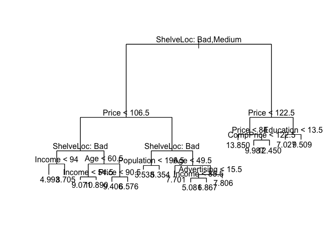
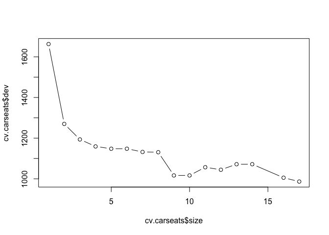
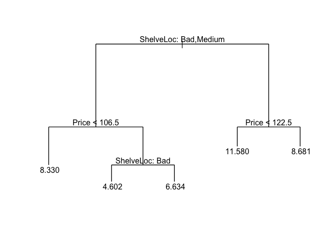
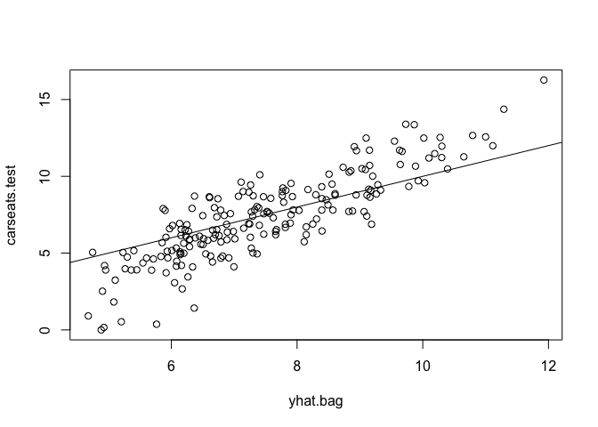
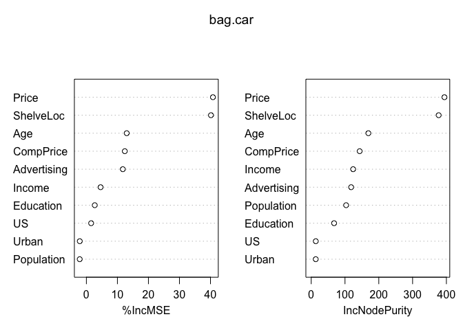

Sridhar Sriram Homework 9
================

## Lab 5.3.1: The Validation Set Approach

#### <span style="color:blue">Splitting the Dataset</span>

``` r
library(ISLR)
set.seed(1)
# of the 392 observations, randomly select 196
train = sample(392, 196)
```

#### <span style="color:blue">Fitting the linear regression w/ only the training set, then expanding for quadratic and cubed regression</span>

``` r
lm.fit = lm(mpg~horsepower, data = Auto, subset = train)

attach(Auto)
mean((mpg-predict(lm.fit,Auto))[-train]^2)
```

    ## [1] 26.14142

``` r
lm.fit.squared = lm(mpg~poly(horsepower,2), data = Auto, subset = train)
lm.fit.cubed = lm(mpg~poly(horsepower,3), data = Auto, subset = train)

mean((mpg-predict(lm.fit.squared,Auto))[-train]^2)
```

    ## [1] 19.82259

``` r
mean((mpg-predict(lm.fit.cubed,Auto))[-train]^2)
```

    ## [1] 19.78252

#### <span style="color:blue">Choosing a different training set</span>

``` r
set.seed(2)
train.2 = sample(392, 196)

lm.2.fit = lm(mpg~horsepower, data = Auto, subset = train.2)
mean((mpg-predict(lm.2.fit,Auto))[-train.2]^2)
```

    ## [1] 23.29559

``` r
lm.2.fit.squared = lm(mpg~poly(horsepower,2), data = Auto, subset = train.2)
lm.2.fit.cubed = lm(mpg~poly(horsepower,3), data = Auto, subset = train.2)

mean((mpg-predict(lm.2.fit.squared,Auto))[-train.2]^2)
```

    ## [1] 18.90124

``` r
mean((mpg-predict(lm.2.fit.cubed,Auto))[-train.2]^2)
```

    ## [1] 19.2574

  - From this outcome we can tell that using a quadratic model is
    definitely better than linear regression model, although cubic is
    not obviously any more
advantageous

## Lab 5.3.2 192-193: LOOCV

#### <span style="color:purple">Showing the `glm()` without a specification of family type and `lm()` are the same</span>

``` r
glm.fit = glm(mpg~horsepower, data = Auto)

coef(glm.fit)
```

    ## (Intercept)  horsepower 
    ##  39.9358610  -0.1578447

``` r
lm.fit.glmcopy = lm(mpg~horsepower, data = Auto)
coef(lm.fit.glmcopy)
```

    ## (Intercept)  horsepower 
    ##  39.9358610  -0.1578447

#### <span style="color:purple">Opting to use `glm()` because of compatability with `cv`</span>

The values found within the `delta` vector of our `cv.err` variable
contain the results from our cross-validation

``` r
library(boot)
glm.fit = glm(mpg~horsepower, data = Auto)
cv.err = cv.glm(Auto, glm.fit)
cv.err$delta
```

    ## [1] 24.23151 24.23114

#### <span style="color:purple">Populating a vector with the associated regression </span>

``` r
cv.error = rep(0,5)
for ( i in 1:5){
  glm.fit = glm(mpg~poly(horsepower,i),data = Auto)
  cv.error[i] = cv.glm(Auto, glm.fit)$delta[1]
}

cv.error
```

    ## [1] 24.23151 19.24821 19.33498 19.42443 19.03321

## Chapter 5, exercise 5 A & B (198 - 199)

``` r
library(ISLR)
attach(Default)
set.seed(1234)

glm.fit.regression <- glm(default~income*balance, family = "binomial")

coef(glm.fit.regression)
```

    ##    (Intercept)         income        balance income:balance 
    ##  -1.091573e+01   1.599661e-06   5.265278e-03   1.193329e-08

``` r
summary(glm.fit.regression)$coef
```

    ##                     Estimate   Std. Error      z value     Pr(>|z|)
    ## (Intercept)    -1.091573e+01 9.488860e-01 -11.50372889 1.263369e-30
    ## income          1.599661e-06 2.682921e-05   0.05962384 9.524552e-01
    ## balance         5.265278e-03 5.647706e-04   9.32286069 1.132450e-20
    ## income:balance  1.193329e-08 1.638066e-08   0.72849895 4.663082e-01

``` r
attach(Default)
```

    ## The following objects are masked from Default (pos = 3):
    ## 
    ##     balance, default, income, student

``` r
set.seed(1354)

train = sample(nrow(Default),nrow(Default)/2)

glm.fit.train <- glm(default~income*balance, family = "binomial", subset=train)

summary(glm.fit.train)$coef
```

    ##                     Estimate   Std. Error    z value     Pr(>|z|)
    ## (Intercept)    -1.205962e+01 1.514935e+00 -7.9604843 1.713672e-15
    ## income          9.749369e-06 4.240617e-05  0.2299045 8.181660e-01
    ## balance         5.790184e-03 8.855269e-04  6.5386877 6.206095e-11
    ## income:balance  1.027836e-08 2.544177e-08  0.4039957 6.862159e-01

``` r
glm.probability = predict(glm.fit.train, type = "response")

glm.prediction = rep("No",length(train))

glm.prediction[glm.probability > 0.5] = "Yes"
```

\*\* Test error rate on the training set: \*\*

``` r
classification.table.train <- table(glm.prediction,default[train])
classification.table.train
```

    ##               
    ## glm.prediction   No  Yes
    ##            No  4814  103
    ##            Yes   19   64

``` r
cat("Error rate of: ",1 - (classification.table.train[1] + classification.table.train[4])/5000)
```

    ## Error rate of:  0.0244

\*\* Test error rate on the training set: \*\*

``` r
classification.table.val<- table(glm.prediction,default[-train])
classification.table.val
```

    ##               
    ## glm.prediction   No  Yes
    ##            No  4753  164
    ##            Yes   81    2

``` r
cat("Error rate of: ",1 - (classification.table.val[1] + classification.table.val[4])/5000)
```

    ## Error rate of:  0.049

## Chapter 8, exercise 8 ( 333 - 334)

1)  train, test sets

<!-- end list -->

``` r
library(ISLR)
attach(Carseats)
set.seed(156)

train.carseats = sample(nrow(Carseats),nrow(Carseats)/2)
carseats.test=Carseats[-train.carseats ,"Sales"]
```

2)  Regression Tree

<!-- end list -->

``` r
library(tree)
tree.carseats = tree(Sales~.,Carseats, subset=train.carseats)

summary(tree.carseats)
```

    ## 
    ## Regression tree:
    ## tree(formula = Sales ~ ., data = Carseats, subset = train.carseats)
    ## Variables actually used in tree construction:
    ## [1] "ShelveLoc"   "Price"       "Income"      "Age"         "Population" 
    ## [6] "Advertising" "CompPrice"   "Education"  
    ## Number of terminal nodes:  17 
    ## Residual mean deviance:  2.063 = 377.6 / 183 
    ## Distribution of residuals:
    ##      Min.   1st Qu.    Median      Mean   3rd Qu.      Max. 
    ## -3.447000 -1.078000  0.005739  0.000000  0.975900  4.146000

``` r
plot(tree.carseats)
text(tree.carseats, pretty = 0)
```

<!-- -->

``` r
yhat=predict (tree.carseats ,newdata=Carseats[-train.carseats ,])
cat("Obtained MSE of: ",mean((yhat -carseats.test)^2))
```

    ## Obtained MSE of:  5.124802

3)  Cross-validation

<!-- end list -->

``` r
cv.carseats = cv.tree(tree.carseats)
cv.carseats
```

    ## $size
    ##  [1] 17 16 14 13 12 11 10  9  8  7  6  5  4  3  2  1
    ## 
    ## $dev
    ##  [1]  986.4486 1005.3384 1071.7825 1071.7825 1044.5041 1056.8837 1016.5187
    ##  [8] 1016.5187 1130.7896 1132.1095 1147.8975 1147.8975 1159.1984 1193.6924
    ## [15] 1270.0111 1662.9011
    ## 
    ## $k
    ##  [1]      -Inf  17.20778  22.26882  23.19946  27.52352  28.73494  31.15063
    ##  [8]  31.81033  51.53923  61.23975  73.71490  74.90618  83.52968  97.68064
    ## [15] 190.89025 416.84938
    ## 
    ## $method
    ## [1] "deviance"
    ## 
    ## attr(,"class")
    ## [1] "prune"         "tree.sequence"

``` r
plot(cv.carseats$size, cv.carseats$dev, type = 'b')
```

<!-- -->

``` r
prune.carseats = prune.tree(tree.carseats,best=5)
plot(prune.carseats)
text(prune.carseats,pretty = 0)
```

<!-- -->

No, pruning does not improve the test MSE

4)  Bagging

<!-- end list -->

``` r
library(randomForest)
```

    ## randomForest 4.6-14

    ## Type rfNews() to see new features/changes/bug fixes.

``` r
set.seed(1)
bag.car = randomForest(Sales~.,data = Carseats, subset = train.carseats, importance = TRUE)


yhat.bag = predict(bag.car, newdata=Carseats[-train.carseats,])
plot(yhat.bag, carseats.test)
abline(0,1)
```

<!-- -->

``` r
cat("Obtain test MSE of: ",mean((yhat.bag - carseats.test)^2))
```

    ## Obtain test MSE of:  2.804214

``` r
varImpPlot(bag.car)
```

<!-- -->

5)  Random Forest

<!-- end list -->

``` r
library(randomForest)
set.seed(1)

minMSE = 10000
min.m = 0
for( i in 1:11){
  car.rf = randomForest(Sales~.,data = Carseats, subset = train.carseats, mtry = i,importance = TRUE)
  yhat.rf = predict(car.rf, newdata=Carseats[-train.carseats,])
  currentMSE = mean((yhat.rf - carseats.test)^2)
  print(currentMSE)
  if(currentMSE<minMSE){
    minMSE = currentMSE
    min.m = i
  }
}
```

    ## [1] 4.641856
    ## [1] 3.293058
    ## [1] 2.73729
    ## [1] 2.605346
    ## [1] 2.483848
    ## [1] 2.404292
    ## [1] 2.405813
    ## [1] 2.404572
    ## [1] 2.403962
    ## [1] 2.401182

    ## Warning in randomForest.default(m, y, ...): invalid mtry: reset to within
    ## valid range

    ## [1] 2.385646

``` r
min.m
```

    ## [1] 11

``` r
car.rf = randomForest(Sales~.,data = Carseats, subset = train.carseats, mtry = i,importance = TRUE)
```

    ## Warning in randomForest.default(m, y, ...): invalid mtry: reset to within
    ## valid range

``` r
yhat.rf = predict(car.rf, newdata=Carseats[-train.carseats,])

cat("Obtain test MSE of: ",mean((yhat.rf - carseats.test)^2))
```

    ## Obtain test MSE of:  2.376525

``` r
varImpPlot(bag.car)
```

<!-- -->
