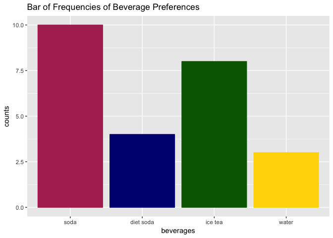

Midterm, Sridhar Sriram
================

Question 1:
-----------

The code sample does the following:

-   assigns the length of vector `myvector` to the variable `n`
-   assigns the values from 1 to `n` into the vector `count`
-   and then checks to see if the values subsetted in pages in `myvector` are equivalent to `value`

Question 2:
-----------

Below is the code to import the dataset `Midterm_Files_2.csv`

``` r
library(readr)
Midterm_File_2 <- read_csv("~/Downloads/Midterm File 2.csv")
```

    ## Parsed with column specification:
    ## cols(
    ##   `0.69` = col_double()
    ## )

``` r
View(Midterm_File_2)
```

``` r
#finding and storing the max value in the Midterm_File_2.csv file
max_midterm_file_value = max(Midterm_File_2[,1])
max_midterm_file_value
```

    ## [1] 1

``` r
#finding and storing the indices where the max value appears
indices = which(Midterm_File_2[,1] == max_midterm_file_value)
indices
```

    ## [1]   12  130  261  442  605  771  999 1232

As indicated by the above code:

-   The maximum value of `Midter_File_2.csv` is 1
-   This value is found at indices `12, 130, 261, 442, 605, 771, 999, 1232`

Question 3:
-----------

using the `scan` function with the `text` parameter set to the input

``` r
beverages <- scan(text = "3 4 1 1 3 4 3 3 1 3 2 1 2 1 2 3 2 3 1 1 1 1 4 3 1")
beverages
```

    ##  [1] 3 4 1 1 3 4 3 3 1 3 2 1 2 1 2 3 2 3 1 1 1 1 4 3 1

Question 4:
-----------

``` r
library(ggplot2)

bev.labeled.fact <- factor(beverages, labels = c("soda","diet soda", "ice tea", "water"))
bev.labeled.fact
```

    ##  [1] ice tea   water     soda      soda      ice tea   water     ice tea  
    ##  [8] ice tea   soda      ice tea   diet soda soda      diet soda soda     
    ## [15] diet soda ice tea   diet soda ice tea   soda      soda      soda     
    ## [22] soda      water     ice tea   soda     
    ## Levels: soda diet soda ice tea water

``` r
ggplot(data = as.data.frame(bev.labeled.fact),
       aes(bev.labeled.fact)) + 
  geom_bar(color=c("maroon","navy","darkgreen","gold"), 
           fill =c("maroon","navy","darkgreen","gold") ) +
  ggtitle("Bar of Frequencies of Beverage Preferences") +
  xlab("beverages")+
  ylab("counts")
```



Question 5:
-----------

``` r
stemmed.data <-c(2,3,16,23,14,12,4,13,2,0,0,6,28,31,14,4,8,2,5)

stem(stemmed.data)
```

    ## 
    ##   The decimal point is 1 digit(s) to the right of the |
    ## 
    ##   0 | 00222344568
    ##   1 | 23446
    ##   2 | 38
    ##   3 | 1

Question 6:
-----------

When called, the `apropos()` returns a character vector containing the elements in the searched data that matches what is specified in the `what` parameter of the function (given in a regular expression format).

Question 7:
-----------

``` r
sals <- c(12,.4,5,2,50,8,3,1,4,.25)
sals.cut <- cut(sals, 
                breaks = c(0,1,5,50),
                labels =c("poor","rich","very rich"))
sals.cut
```

    ##  [1] very rich poor      rich      rich      very rich very rich rich     
    ##  [8] poor      rich      poor     
    ## Levels: poor rich very rich

``` r
sals.table <- table(sals.cut)
sals.table
```

    ## sals.cut
    ##      poor      rich very rich 
    ##         3         4         3

Question 8:
-----------

``` r
numbers<- rnorm(100,mean = 5, sd = 3)
ggplot(data.frame(numbers), aes(numbers))+
  geom_histogram(binwidth = 2)
```


Question 9:
-----------

You can make R report *only* `x` number of decimals by using the `round` function with the following syntax:

-   `round(<number>,<x = # decimal places>)`

for x= 3:

``` r
round(1.453363536553, 3)
```

    ## [1] 1.453

for x = 1:

``` r
round(1.453363536553, 2)
```

    ## [1] 1.45

for x = 6

``` r
round(1.453363536553, 6)
```

    ## [1] 1.453364

Question 10:
------------

found that the `prop.table` function works perfectly for this exercise

``` r
smokes <- (c("Y","N","N","Y","N","Y","Y","Y","N","Y"))
study <- c(1,2,2,3,3,1,2,1,3,2)

tmp.rows.addto1 <- table(x=smokes, 
                     y = study)

prop.table(tmp.rows.addto1,1)
```

    ##    y
    ## x           1         2         3
    ##   N 0.0000000 0.5000000 0.5000000
    ##   Y 0.5000000 0.3333333 0.1666667

Question 11:
------------

``` r
tmp.cols.addto1 <- table(x=smokes, 
                     y = study)
prop.table(tmp.cols.addto1,2)
```

    ##    y
    ## x           1         2         3
    ##   N 0.0000000 0.5000000 0.6666667
    ##   Y 1.0000000 0.5000000 0.3333333

Question 12:
------------

``` r
tmp.table.addto1 <- table(x=smokes, 
                     y = study)
prop.table(tmp.table.addto1)
```

    ##    y
    ## x     1   2   3
    ##   N 0.0 0.2 0.2
    ##   Y 0.3 0.2 0.1

Question 13:
------------

Because there is no "Acceptance Rate" column, I created a vector that calculated all of the acceptance rates, and used this vector as the basis for my answer to this question. (The ouputted values are the answers to this questions, as more than one college has a 100% acceptance rate)

``` r
library(readr)
College <- read_csv("~/Downloads/College.csv")
```

    ## Warning: Missing column names filled in: 'X1' [1]

    ## Parsed with column specification:
    ## cols(
    ##   X1 = col_character(),
    ##   Private = col_character(),
    ##   Apps = col_integer(),
    ##   Accept = col_integer(),
    ##   Enroll = col_integer(),
    ##   Top10perc = col_integer(),
    ##   Top25perc = col_integer(),
    ##   F.Undergrad = col_integer(),
    ##   P.Undergrad = col_integer(),
    ##   Outstate = col_integer(),
    ##   Room.Board = col_integer(),
    ##   Books = col_integer(),
    ##   Personal = col_integer(),
    ##   PhD = col_integer(),
    ##   Terminal = col_integer(),
    ##   S.F.Ratio = col_double(),
    ##   perc.alumni = col_integer(),
    ##   Expend = col_integer(),
    ##   Grad.Rate = col_integer()
    ## )

``` r
Collegecopy<- College
college.acceptancerate <- College$Accept / College$Apps

maximum.acceptancerates <- which(college.acceptancerate == max(college.acceptancerate))


Collegecopy[maximum.acceptancerates,1]
```

    ## # A tibble: 6 x 1
    ##   X1                              
    ##   <chr>                           
    ## 1 Emporia State University        
    ## 2 Mayville State University       
    ## 3 MidAmerica Nazarene College     
    ## 4 Southwest Baptist University    
    ## 5 University of Wisconsin-Superior
    ## 6 Wayne State College

Question 14:
------------

``` r
Collegecopy$acceptancerates <- college.acceptancerate


College.privates <- Collegecopy[which(College$Private=="Yes"),]
College.publics <- Collegecopy[which(College$Private=="No"),]


t.test(College.privates$acceptancerates, College.publics$acceptancerates, conf.level = 0.95)
```

    ## 
    ##  Welch Two Sample t-test
    ## 
    ## data:  College.privates$acceptancerates and College.publics$acceptancerates
    ## t = 2.3765, df = 379.67, p-value = 0.01797
    ## alternative hypothesis: true difference in means is not equal to 0
    ## 95 percent confidence interval:
    ##  0.004842438 0.051258960
    ## sample estimates:
    ## mean of x mean of y 
    ## 0.7545812 0.7265305

Because of a statistically significant p-value, at a confidence level of 95%, private schools *do not* accept at the the same rate as public schools.

Question 15:
------------

Surprisingly, the number of out of state students has the highest correlation with graduation rates with a 0.5713 correlation

``` r
attach(Collegecopy)


#I type-casted the "Yes" values in the Private column to 1s and the "No" values to 0
things<-ifelse(Collegecopy[,2]=="Yes",1,0)

#altered the College dataset, adding in the typecasted Private column
Collegecopy2<-Collegecopy
Collegecopy2$Private <- things
Collegecopy2
```

    ## # A tibble: 777 x 20
    ##    X1          Private  Apps Accept Enroll Top10perc Top25perc F.Undergrad
    ##    <chr>         <dbl> <int>  <int>  <int>     <int>     <int>       <int>
    ##  1 Abilene Ch…    1.00  1660   1232    721        23        52        2885
    ##  2 Adelphi Un…    1.00  2186   1924    512        16        29        2683
    ##  3 Adrian Col…    1.00  1428   1097    336        22        50        1036
    ##  4 Agnes Scot…    1.00   417    349    137        60        89         510
    ##  5 Alaska Pac…    1.00   193    146     55        16        44         249
    ##  6 Albertson …    1.00   587    479    158        38        62         678
    ##  7 Albertus M…    1.00   353    340    103        17        45         416
    ##  8 Albion Col…    1.00  1899   1720    489        37        68        1594
    ##  9 Albright C…    1.00  1038    839    227        30        63         973
    ## 10 Alderson-B…    1.00   582    498    172        21        44         799
    ## # ... with 767 more rows, and 12 more variables: P.Undergrad <int>,
    ## #   Outstate <int>, Room.Board <int>, Books <int>, Personal <int>,
    ## #   PhD <int>, Terminal <int>, S.F.Ratio <dbl>, perc.alumni <int>,
    ## #   Expend <int>, Grad.Rate <int>, acceptancerates <dbl>

``` r
##filtered out the column containing the college names because obviously this variable cannot be correlated to the graduation rate
cordata <- Collegecopy2[,2:length(Collegecopy)]

#temporary vector that holds the correlation matrix for the entire dataset
storage<-round(cor(cordata),4)
storage
```

    ##                 Private    Apps  Accept  Enroll Top10perc Top25perc
    ## Private          1.0000 -0.4321 -0.4753 -0.5679    0.1641    0.0958
    ## Apps            -0.4321  1.0000  0.9435  0.8468    0.3388    0.3516
    ## Accept          -0.4753  0.9435  1.0000  0.9116    0.1924    0.2475
    ## Enroll          -0.5679  0.8468  0.9116  1.0000    0.1813    0.2267
    ## Top10perc        0.1641  0.3388  0.1924  0.1813    1.0000    0.8920
    ## Top25perc        0.0958  0.3516  0.2475  0.2267    0.8920    1.0000
    ## F.Undergrad     -0.6156  0.8145  0.8742  0.9646    0.1413    0.1994
    ## P.Undergrad     -0.4521  0.3983  0.4413  0.5131   -0.1054   -0.0536
    ## Outstate         0.5526  0.0502 -0.0258 -0.1555    0.5623    0.4894
    ## Room.Board       0.3405  0.1649  0.0909 -0.0402    0.3715    0.3315
    ## Books           -0.0185  0.1326  0.1135  0.1127    0.1189    0.1155
    ## Personal        -0.3045  0.1787  0.2010  0.2809   -0.0933   -0.0808
    ## PhD             -0.1567  0.3907  0.3558  0.3315    0.5318    0.5459
    ## Terminal        -0.1296  0.3695  0.3376  0.3083    0.4911    0.5247
    ## S.F.Ratio       -0.4722  0.0956  0.1762  0.2373   -0.3849   -0.2946
    ## perc.alumni      0.4148 -0.0902 -0.1600 -0.1808    0.4555    0.4179
    ## Expend           0.2585  0.2596  0.1247  0.0642    0.6609    0.5274
    ## Grad.Rate        0.3362  0.1468  0.0673 -0.0223    0.4950    0.4773
    ## acceptancerates  0.0850 -0.3926 -0.1752 -0.1522   -0.4787   -0.4347
    ##                 F.Undergrad P.Undergrad Outstate Room.Board   Books
    ## Private             -0.6156     -0.4521   0.5526     0.3405 -0.0185
    ## Apps                 0.8145      0.3983   0.0502     0.1649  0.1326
    ## Accept               0.8742      0.4413  -0.0258     0.0909  0.1135
    ## Enroll               0.9646      0.5131  -0.1555    -0.0402  0.1127
    ## Top10perc            0.1413     -0.1054   0.5623     0.3715  0.1189
    ## Top25perc            0.1994     -0.0536   0.4894     0.3315  0.1155
    ## F.Undergrad          1.0000      0.5705  -0.2157    -0.0689  0.1155
    ## P.Undergrad          0.5705      1.0000  -0.2535    -0.0613  0.0812
    ## Outstate            -0.2157     -0.2535   1.0000     0.6543  0.0389
    ## Room.Board          -0.0689     -0.0613   0.6543     1.0000  0.1280
    ## Books                0.1155      0.0812   0.0389     0.1280  1.0000
    ## Personal             0.3172      0.3199  -0.2991    -0.1994  0.1793
    ## PhD                  0.3183      0.1491   0.3830     0.3292  0.0269
    ## Terminal             0.3000      0.1419   0.4080     0.3745  0.1000
    ## S.F.Ratio            0.2797      0.2325  -0.5548    -0.3626 -0.0319
    ## perc.alumni         -0.2295     -0.2808   0.5663     0.2724 -0.0402
    ## Expend               0.0187     -0.0836   0.6728     0.5017  0.1124
    ## Grad.Rate           -0.0788     -0.2570   0.5713     0.4249  0.0011
    ## acceptancerates     -0.1557     -0.0923  -0.2410    -0.3103 -0.1741
    ##                 Personal     PhD Terminal S.F.Ratio perc.alumni  Expend
    ## Private          -0.3045 -0.1567  -0.1296   -0.4722      0.4148  0.2585
    ## Apps              0.1787  0.3907   0.3695    0.0956     -0.0902  0.2596
    ## Accept            0.2010  0.3558   0.3376    0.1762     -0.1600  0.1247
    ## Enroll            0.2809  0.3315   0.3083    0.2373     -0.1808  0.0642
    ## Top10perc        -0.0933  0.5318   0.4911   -0.3849      0.4555  0.6609
    ## Top25perc        -0.0808  0.5459   0.5247   -0.2946      0.4179  0.5274
    ## F.Undergrad       0.3172  0.3183   0.3000    0.2797     -0.2295  0.0187
    ## P.Undergrad       0.3199  0.1491   0.1419    0.2325     -0.2808 -0.0836
    ## Outstate         -0.2991  0.3830   0.4080   -0.5548      0.5663  0.6728
    ## Room.Board       -0.1994  0.3292   0.3745   -0.3626      0.2724  0.5017
    ## Books             0.1793  0.0269   0.1000   -0.0319     -0.0402  0.1124
    ## Personal          1.0000 -0.0109  -0.0306    0.1363     -0.2860 -0.0979
    ## PhD              -0.0109  1.0000   0.8496   -0.1305      0.2490  0.4328
    ## Terminal         -0.0306  0.8496   1.0000   -0.1601      0.2671  0.4388
    ## S.F.Ratio         0.1363 -0.1305  -0.1601    1.0000     -0.4029 -0.5838
    ## perc.alumni      -0.2860  0.2490   0.2671   -0.4029      1.0000  0.4177
    ## Expend           -0.0979  0.4328   0.4388   -0.5838      0.4177  1.0000
    ## Grad.Rate        -0.2693  0.3050   0.2895   -0.3067      0.4909  0.3903
    ## acceptancerates   0.0200 -0.3183  -0.3038    0.1100     -0.1321 -0.4086
    ##                 Grad.Rate acceptancerates
    ## Private            0.3362          0.0850
    ## Apps               0.1468         -0.3926
    ## Accept             0.0673         -0.1752
    ## Enroll            -0.0223         -0.1522
    ## Top10perc          0.4950         -0.4787
    ## Top25perc          0.4773         -0.4347
    ## F.Undergrad       -0.0788         -0.1557
    ## P.Undergrad       -0.2570         -0.0923
    ## Outstate           0.5713         -0.2410
    ## Room.Board         0.4249         -0.3103
    ## Books              0.0011         -0.1741
    ## Personal          -0.2693          0.0200
    ## PhD                0.3050         -0.3183
    ## Terminal           0.2895         -0.3038
    ## S.F.Ratio         -0.3067          0.1100
    ## perc.alumni        0.4909         -0.1321
    ## Expend             0.3903         -0.4086
    ## Grad.Rate          1.0000         -0.2870
    ## acceptancerates   -0.2870          1.0000

``` r
#The correlation matrix pertaining to the Graduation Rate column
grad.rate.correlations<-data.frame(storage[-18,"Grad.Rate"])
grad.rate.correlations
```

    ##                 storage..18...Grad.Rate..
    ## Private                            0.3362
    ## Apps                               0.1468
    ## Accept                             0.0673
    ## Enroll                            -0.0223
    ## Top10perc                          0.4950
    ## Top25perc                          0.4773
    ## F.Undergrad                       -0.0788
    ## P.Undergrad                       -0.2570
    ## Outstate                           0.5713
    ## Room.Board                         0.4249
    ## Books                              0.0011
    ## Personal                          -0.2693
    ## PhD                                0.3050
    ## Terminal                           0.2895
    ## S.F.Ratio                         -0.3067
    ## perc.alumni                        0.4909
    ## Expend                             0.3903
    ## acceptancerates                   -0.2870

``` r
grad.rate.correlations[which(grad.rate.correlations == max(abs(grad.rate.correlations))),]
```

    ## [1] 0.5713

Question 16:
------------

Instead of creating my own data, I decided to randomly generate variables to demonstrate heteroscedasticity. The variability in variance in increases as values increase, and heteroscedasticity is further supported by the plotting of the `lm` function's support plots

``` r
set.seed(123)
x <- 1:1000
y <- rnorm(n=1000, mean = x, sd=0.4*x)
plot(x,y)   
abline(0,1, col="red")
```


``` r
par(mfrow=c(2,2))
plot(lm(x~y))
```


Question 17:
------------

``` r
eight.values <- 1:8
choose <- function(n) {
  mean(sample(eight.values, size = n, replace = TRUE))
}

plot(sapply(1:1000, choose), type = "l", xlab = "# of dice", ylab = "average")
```


The law of large numbers dictates that after a large number of iterations/trials have been conducted, the results will eventually converge/even out to a theoretical point. This is shown by the high variance in the initial results being reduced over time.

Question 18:
------------

``` r
set.seed(1648) # for reproducability
# create an empty vector for the means of exponential samples
clt <- NULL 
n <- 40 # sample size
lambda <- 0.2 # always use lambda = 0.2 for these sims

# take the mean of 40 samples of the exponential distribution. repeat 1,000 times
for (i in 1:1000) {
      clt <- c(clt, mean(rexp(n, lambda))) 
}
hist(clt, xlab='Sample Mean', main="Histogram of Sample Means from an Exponential Distribution (n=40)", col='beige')
```


``` r
sd(clt)
```

    ## [1] 0.7749029

Because the CLT states that when independent random variables are added to a distribution, over time the distribution becomes normally disributed, the code above does the same. The standard deviation is rought 0.78, with normal distribution and variance

Question 19:
------------

``` r
site1 <- c(93,120,65,105,115,82,99,87,100,90,78,95,93,88,110)
site2<- c(85,45,80,28,75,70,65,55,50,40)
site3<- c(100, 75, 65,40,73,65,50,30,45,50)
site4<-c(96,58,95,90,65,80,85,95,82)

siteData <- data.frame(
       Y=c(site1, site2, site3, site4),
       Site =factor(rep(c("site1", "site2", "site3", "site4"), times=c(length(site1), length(site2), length(site3), length(site4))))
       )

test_set <- aov(Y~Site, data=siteData)
anova(test_set)
```

    ## Analysis of Variance Table
    ## 
    ## Response: Y
    ##           Df Sum Sq Mean Sq F value    Pr(>F)    
    ## Site       3  11230  3743.4  13.286 3.673e-06 ***
    ## Residuals 40  11270   281.8                      
    ## ---
    ## Signif. codes:  0 '***' 0.001 '**' 0.01 '*' 0.05 '.' 0.1 ' ' 1

Due to a very low p-value, we can conclude that there is a difference between the means.

Question 20:
------------

``` r
boxplot(site1,site2, site3, site4)
```


Yes, this plot supports my conclusion in 19 because there is definitely a difference between the means.
